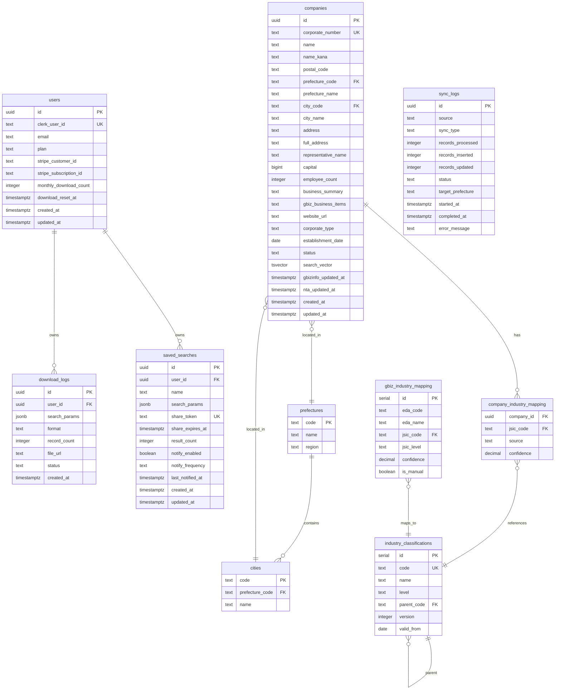
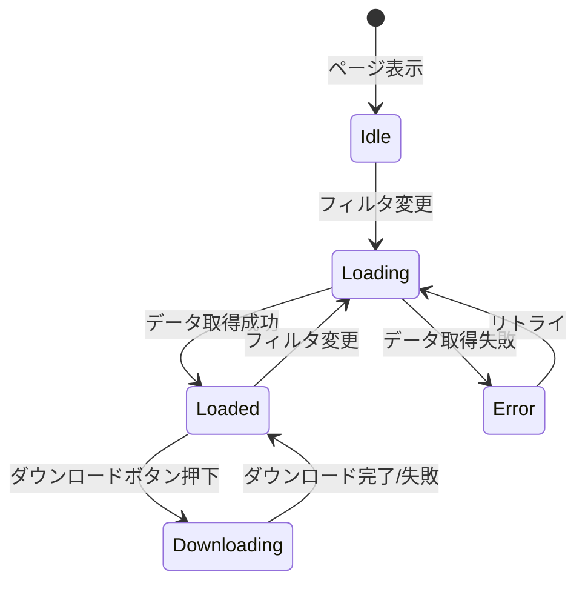
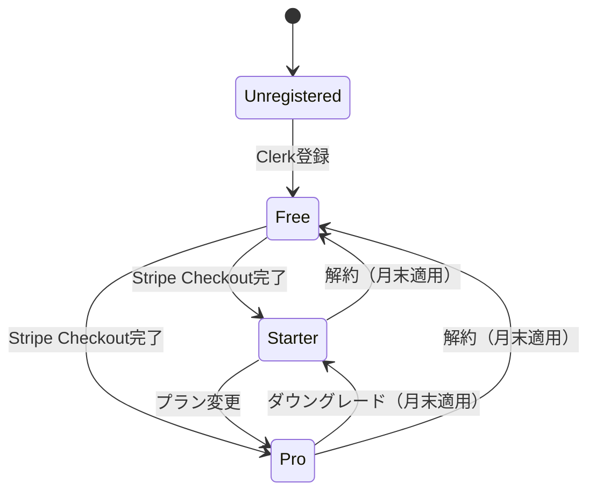
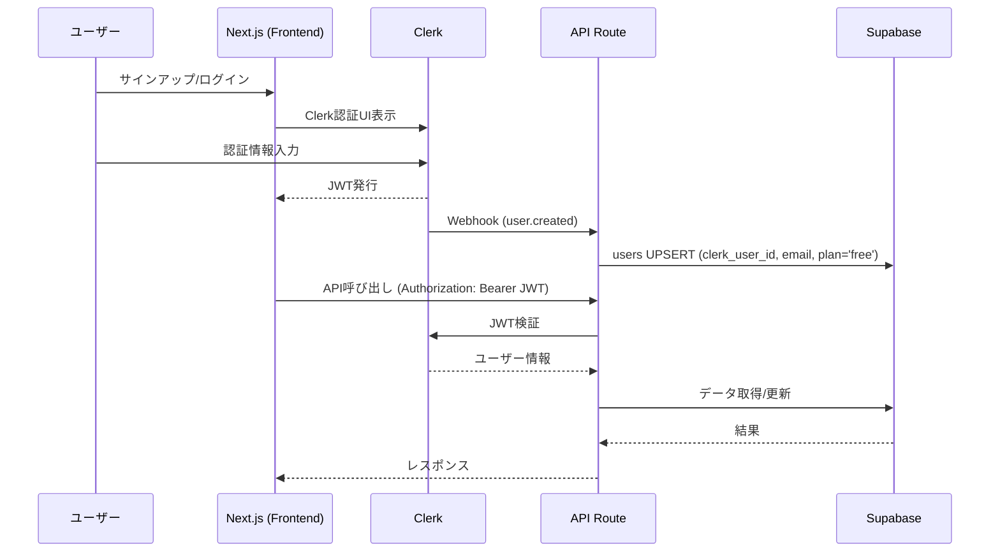
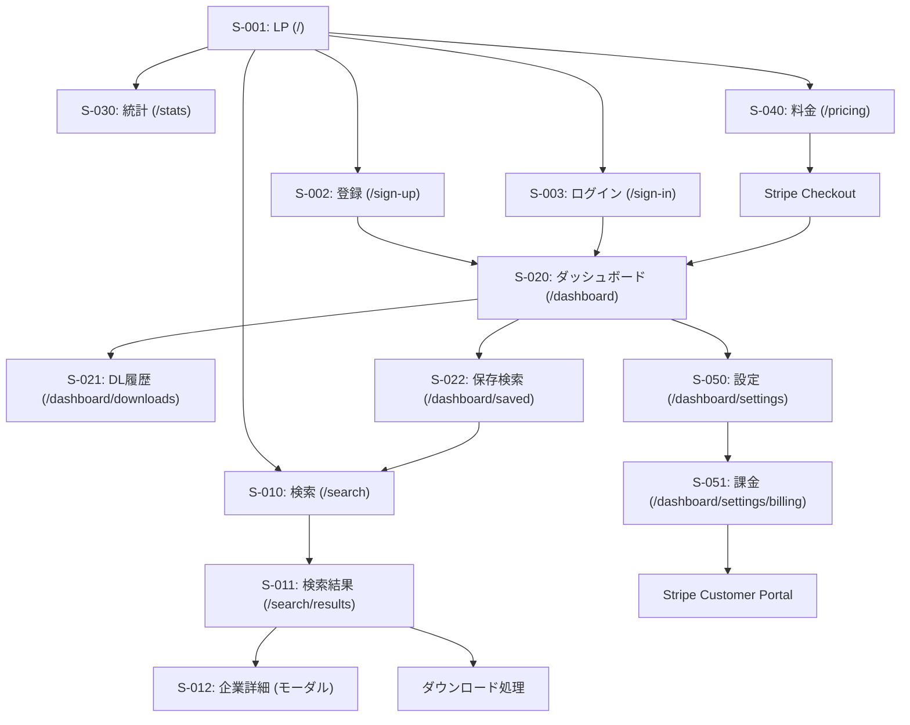
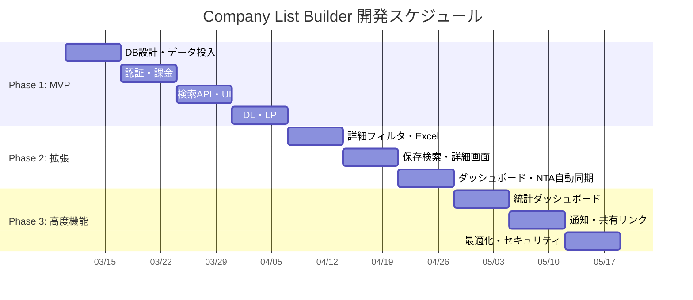

# Company List Builder - 機能仕様書

**プロジェクト名**: Company List Builder（企業リストビルダー）
**Phase**: 2 - Design
**作成日**: 2026-03-05
**ステータス**: Draft
**入力ドキュメント**:
- `docs/requirements/company-list-builder-requirements.md`
- `docs/requirements/company-list-builder-design-requirements.md`

---

## 1. 概要

### 1.1 プロジェクトサマリー

日本全国の法人情報（約500万件）を業種・地域で絞り込み、営業リスト・マーケティングリストをCSV/Excelでダウンロードできるwebアプリケーション。

政府公開データ（gBizINFO REST API + 国税庁法人番号）を活用し、データ取得コストゼロで競合比80%安のフリーミアムSaaSを提供する。

**技術スタック**: Next.js 15 (App Router) / TypeScript / Supabase (PostgreSQL) / Clerk / Stripe / Vercel

### 1.2 スコープ

#### In-Scope（対象範囲）

| カテゴリ | 内容 |
|---------|------|
| データ取得 | gBizINFO REST API日次差分同期、国税庁CSV月次全件インポート |
| データ統合 | 法人番号ベースの名寄せ、産業分類マッピング |
| 検索 | 業種（日本標準産業分類）、地域（都道府県・市区町村）、詳細フィルタ |
| ダウンロード | CSV/Excel、UTF-8/Shift-JIS、プラン別件数制限 |
| 認証 | Clerk（メール+パスワード、Google OAuth） |
| 課金 | Stripe月額サブスクリプション（Free/Starter/Pro） |
| 統計 | 業種x地域ヒートマップ、グラフ |
| 通知 | 新規法人マッチ通知（メール） |

#### Out-of-Scope（対象外）

| 内容 | 理由 |
|------|------|
| CC-Auth統合 | Phase 2以降のオプション。初期はClerkで独立構築（C-001解決） |
| CRM連携（Salesforce/HubSpot等） | MVP後の拡張機能 |
| 電話番号・メールアドレスのスクレイピング | 法的リスク。政府公開データのみ使用 |
| リアルタイムAPI（gBizINFOへのプロキシ） | バッチ同期＋ローカルDB方式を採用 |
| ダークモード | データテーブルの視認性を最優先しライトモード固定 |
| 多言語対応 | 日本法人データのため日本語のみ |

### 1.3 前提条件・制約

| ID | 区分 | 内容 |
|----|------|------|
| PC-001 | 前提 | gBizINFO REST APIアクセストークンを事前申請・取得済みであること |
| PC-002 | 前提 | 国税庁法人番号Web-APIアプリケーションIDを取得済みであること |
| PC-003 | 前提 | Supabase Proプラン（$25/月）を初期から使用する（500MB Freeでは不足） |
| PC-004 | 制約 | gBizINFO APIのレートリミットは非公開。初回データ投入は「国税庁CSV先行 + gBizINFO後追い付与」方式で安全に実施する（C-003解決） |
| PC-005 | 制約 | Supabase Proの8GBストレージ上限に対し、500万件+インデックス+tsvector+MVで6-8GB超の可能性あり。ストレージバジェットの精密管理が必要（C-002解決） |
| PC-006 | 制約 | Vercel Hobbyプランの10秒API実行制限。大量ダウンロード生成はSupabase Edge Functionsで実行する（H-006解決） |
| PC-007 | 制約 | 認証はClerkで独立構築。CC-Auth統合はPhase 2以降のオプション（C-001解決） |

### 1.4 用語定義

| 用語 | 定義 |
|------|------|
| 法人番号 | 国税庁が付与する13桁の一意識別番号。法人の名寄せキーとして使用 |
| gBizINFO | 経済産業省が運営する法人情報データベース。REST APIで業種・詳細情報を取得可能 |
| 国税庁法人番号公表サイト | 国税庁が全法人の基本3情報（法人番号・商号・所在地）をCSV/APIで公開 |
| 日本標準産業分類 | 総務省が定める産業の分類体系。大分類(A-T, 20種)→中分類(99種)→小分類→細分類の階層構造 |
| 名寄せ | 複数データソースの同一法人レコードを法人番号で統合するプロセス |
| edaCode | gBizINFOが法人に付与する業種コード。日本標準産業分類へのマッピングに使用 |
| Materialized View (MV) | PostgreSQLの事前集計ビュー。検索件数表示の高速化に使用 |
| tsvector | PostgreSQLの全文検索用データ型。法人名・事業概要の日本語全文検索に使用 |
| ライブカウンター | フィルタ条件変更時に検索結果件数をリアルタイム更新する仕組み |
| ダウンロード件数 | ユーザーがダウンロードしたレコード数の累計（H-004: 1回のダウンロードファイル数ではなくレコード数） |
| share_token | 検索条件共有リンクに付与するUUID。認証不要だがレートリミット適用（H-008） |

---

## 2. データアーキテクチャ

### 2.1 gBizINFO API統合仕様

#### エンドポイント

| 項目 | 値 |
|------|-----|
| ベースURL | `https://info.gbiz.go.jp/hojin/v1/hojin` |
| 認証 | `X-hojinInfo-api-token: {TOKEN}` ヘッダー |
| レスポンス形式 | JSON |
| ページネーション | `page` パラメータ（1始まり、1ページ最大5000件） |

#### 取得フィールドマッピング

| gBizINFO フィールド | companiesカラム | 備考 |
|---------------------|----------------|------|
| `corporate_number` | `corporate_number` | 法人番号（13桁） |
| `name` | `name` | 法人名 |
| `name_kana` | `name_kana` | 法人名カナ（存在する場合） |
| `location` | `full_address` | 所在地全文。都道府県・市区町村はパース |
| `representative_name` | `representative_name` | 代表者名 |
| `capital_stock` | `capital` | 資本金（円） |
| `employee_number` | `employee_count` | 従業員数 |
| `business_summary` | `business_summary` | 事業概要 |
| `company_url` | `website_url` | 企業HP |
| `date_of_establishment` | `establishment_date` | 設立年月日 |
| `business_items` | `gbiz_business_items` | 営業品目（自由テキスト、サブ情報として保持） |
| `edaCode` | → `company_industry_mapping` | 業種コード。マッピングテーブル経由で産業分類に変換（C-004解決） |

#### リクエスト例（都道府県別差分取得）

```json
// GET https://info.gbiz.go.jp/hojin/v1/hojin?prefecture=13&page=1
// Headers: { "X-hojinInfo-api-token": "YOUR_TOKEN" }

// レスポンス例
{
  "hojin-infos": [
    {
      "corporate_number": "1010001000001",
      "name": "株式会社サンプル",
      "location": "東京都千代田区永田町一丁目1番1号",
      "representative_name": "山田太郎",
      "capital_stock": 10000000,
      "employee_number": "50",
      "business_summary": "ソフトウェアの開発及び販売",
      "company_url": "https://example.co.jp",
      "date_of_establishment": "2000-01-15",
      "business_items": "情報処理サービス,ソフトウェア開発",
      "update_date": "2026-03-01"
    }
  ],
  "totalCount": 450000,
  "totalPage": 90,
  "pageNumber": 1
}
```

#### レートリミット対策（C-003解決）

gBizINFO APIのレートリミットが非公開のため、以下の安全策を適用する。

| 対策 | 値 | 理由 |
|------|-----|------|
| リクエスト間隔 | 初期: 1,000ms → 実測後調整 | 429応答を回避 |
| 同時接続数 | 1（シーケンシャル） | サーバー負荷軽減 |
| リトライ | 指数バックオフ（2s→4s→8s→16s→32s、最大5回） | 一時的エラーの回復 |
| 429応答時 | 間隔を2倍に拡大 + 10分待機 | 自動適応 |
| 日次上限 | 10,000リクエスト/日（自主制限） | API提供元への配慮 |
| バッチサイズ | 都道府県単位（47分割） | 失敗時の再開が容易 |

### 2.2 国税庁データ統合仕様

#### データソース

| 項目 | 値 |
|------|-----|
| 全件CSV URL | `https://www.houjin-bangou.nta.go.jp/download/zenken/` |
| 形式 | CSV（Shift-JIS、都道府県別ファイル） |
| 更新頻度 | 月次（毎月第2営業日頃） |
| ファイル数 | 都道府県別47ファイル + 国外1ファイル |
| 総レコード数 | 約600万件 |

#### CSVフィールドマッピング

| CSVカラム位置 | 内容 | companiesカラム |
|-------------|------|----------------|
| 1 | シーケンス番号 | (使用しない) |
| 2 | 法人番号 | `corporate_number` |
| 3 | 処理区分 | (名寄せ判定用) |
| 4 | 訂正区分 | (名寄せ判定用) |
| 5 | 更新年月日 | `nta_updated_at` |
| 6 | 変更年月日 | (履歴用) |
| 7 | 商号又は名称 | `name` (国税庁優先) |
| 8 | 国内所在地（イメージID） | (使用しない) |
| 9 | 国内所在地（都道府県） | `prefecture_name` (国税庁優先) |
| 10 | 国内所在地（市区町村） | `city_name` (国税庁優先) |
| 11 | 国内所在地（丁目番地等） | `address` (国税庁優先) |
| 12 | 国内所在地（イメージID2） | (使用しない) |
| 13 | 都道府県コード | `prefecture_code` |
| 14 | 市区町村コード | `city_code` |
| 15 | 郵便番号 | `postal_code` |
| 22 | 法人種別 | `corporate_type` |

#### 全件インポート戦略（H-001解決）

Supabase `pg_cron`は長時間ジョブに不向きなため、外部ジョブランナーを使用する。

```
[GitHub Actions] (月次 Cron: 0 18 2 * *)  ← UTC 18:00 = JST 03:00
    │
    ├── Step 1: 国税庁サイトから47都道府県CSVをダウンロード
    │           (curl + 並列ダウンロード、約10分)
    │
    ├── Step 2: CSV前処理
    │           - Shift-JIS → UTF-8変換
    │           - ヘッダー正規化
    │           - 閉鎖法人フラグ付与
    │           (約5分)
    │
    ├── Step 3: Supabase Edge Function呼び出し
    │           - バッチサイズ: 5,000レコード/リクエスト
    │           - 都道府県ごとに順次実行（47回）
    │           - UPSERT (ON CONFLICT corporate_number)
    │           (約60-90分)
    │
    └── Step 4: 後処理
            - search_vector再計算
            - Materialized View更新
            - sync_logsへの記録
            (約15分)
```

**GitHub Actionsワークフロー**:

```yaml
# .github/workflows/nta-sync.yml
name: NTA Monthly Sync
on:
  schedule:
    - cron: '0 18 2 * *'  # 毎月2日 JST 03:00
  workflow_dispatch: {}    # 手動実行対応

jobs:
  sync:
    runs-on: ubuntu-latest
    timeout-minutes: 180
    steps:
      - uses: actions/checkout@v4
      - uses: actions/setup-node@v4
        with:
          node-version: '20'
      - run: npm ci
      - run: node scripts/nta-csv-import.js
        env:
          SUPABASE_URL: ${{ secrets.SUPABASE_URL }}
          SUPABASE_SERVICE_ROLE_KEY: ${{ secrets.SUPABASE_SERVICE_ROLE_KEY }}
```

### 2.3 名寄せルール（法人番号統合）（H-002解決）

法人番号（`corporate_number`、13桁）を統合キーとし、以下の優先ルールでフィールドをマージする。

#### フィールド別優先ルール

| フィールド | 優先データソース | 理由 |
|-----------|----------------|------|
| `name`（法人名） | **国税庁** | 法的に正式な商号。変更履歴も正確 |
| `name_kana`（法人名カナ） | gBizINFO | 国税庁CSVにカナなし |
| `prefecture_code`/`prefecture_name` | **国税庁** | 住所変更が最新で反映される |
| `city_code`/`city_name` | **国税庁** | 同上 |
| `address`（番地以降） | **国税庁** | 同上 |
| `postal_code` | **国税庁** | 同上 |
| `representative_name`（代表者） | **gBizINFO** | 国税庁CSVに代表者情報なし |
| `capital`（資本金） | **gBizINFO** | 国税庁CSVに資本金なし |
| `employee_count`（従業員数） | **gBizINFO** | 国税庁CSVに従業員情報なし |
| `business_summary`（事業概要） | **gBizINFO** | 国税庁にこの情報なし |
| `website_url` | **gBizINFO** | 国税庁にこの情報なし |
| `establishment_date` | **gBizINFO** | 国税庁にこの情報なし |
| `corporate_type`（法人種別） | **国税庁** | 法的分類の正確性 |
| `company_industry_mapping` | **gBizINFO edaCode→マッピング** | 国税庁に業種情報なし。`company_industry_mapping`テーブルにUPSERT |
| `status` | **国税庁** | 閉鎖・合併の情報が正確 |

#### 名寄せアルゴリズム

```sql
-- UPSERT with merge logic
INSERT INTO companies (
  corporate_number, name, prefecture_code, prefecture_name,
  city_code, city_name, address, postal_code, corporate_type, status,
  nta_updated_at
)
VALUES ($1, $2, $3, $4, $5, $6, $7, $8, $9, $10, NOW())
ON CONFLICT (corporate_number) DO UPDATE SET
  -- 国税庁優先フィールド（常に上書き）
  name = EXCLUDED.name,
  prefecture_code = EXCLUDED.prefecture_code,
  prefecture_name = EXCLUDED.prefecture_name,
  city_code = EXCLUDED.city_code,
  city_name = EXCLUDED.city_name,
  address = EXCLUDED.address,
  postal_code = EXCLUDED.postal_code,
  corporate_type = EXCLUDED.corporate_type,
  status = EXCLUDED.status,
  nta_updated_at = NOW(),
  updated_at = NOW();
  -- gBizINFO優先フィールド（representative_name, capital等）は上書きしない
```

### 2.4 産業分類マッピング仕様（C-004解決）

#### 方針

gBizINFOの`edaCode`（業種コード）フィールドを主キーとし、日本標準産業分類へマッピングする。自由テキストの「営業品目（business_items）」はサブ情報として`gbiz_business_items`カラムに保持する。

#### マッピングテーブル

```sql
CREATE TABLE gbiz_industry_mapping (
  id            SERIAL PRIMARY KEY,
  eda_code      TEXT NOT NULL,          -- gBizINFO edaCode
  eda_name      TEXT NOT NULL,          -- gBizINFO 業種名
  jsic_code     TEXT NOT NULL,          -- 日本標準産業分類コード
  jsic_level    TEXT NOT NULL,          -- major/middle/minor/detail
  confidence    DECIMAL(3,2) NOT NULL DEFAULT 1.00, -- マッピング信頼度
  is_manual     BOOLEAN NOT NULL DEFAULT false,     -- 手動マッピングか
  created_at    TIMESTAMPTZ NOT NULL DEFAULT NOW(),
  updated_at    TIMESTAMPTZ NOT NULL DEFAULT NOW(),
  UNIQUE(eda_code, jsic_code)
);

-- マッピング例
INSERT INTO gbiz_industry_mapping (eda_code, eda_name, jsic_code, jsic_level, confidence) VALUES
('01', '農業', 'A', 'major', 1.00),
('02', '林業', 'A', 'major', 1.00),
('05', '食料品製造業', 'E09', 'middle', 0.95),
('10', '情報サービス業', 'G39', 'middle', 0.90),
('11', 'インターネット附随サービス業', 'G40', 'middle', 0.90);
```

#### マッピングフロー

```
gBizINFO法人データ取得
    │
    ├── edaCode あり → gbiz_industry_mapping で JSIC コード取得
    │     ├── マッピング存在 → company_industry_mapping テーブルに INSERT（company_id, jsic_code, source='gbizinfo'）
    │     └── マッピング不在 → unmapped_industries テーブルに記録 + 手動レビュー待ち
    │
    └── edaCode なし → business_items テキスト解析（将来拡張）
          └── 現時点: company_industry_mapping へのINSERTなし、gbiz_business_items に保持
```

### 2.5 データ同期バッチ設計（初回/差分）

#### 初回データ投入戦略（C-003解決）

gBizINFO APIのレートリミットが非公開のため、安全な「国税庁CSV先行」方式を採用する。

```
Phase A: 国税庁CSV全件インポート (1日目)
    ├── 47都道府県CSVダウンロード + UTF-8変換
    ├── companiesテーブルへUPSERT（約600万件）
    ├── 基本3情報（法人番号・法人名・所在地）のみ
    └── 所要時間: 約2-3時間

Phase B: gBizINFO API漸進的付与 (2日目〜14日目)
    ├── 都道府県単位で順次API取得（47都道府県）
    ├── 1都道府県/日のペースで安全に取得
    ├── 取得完了分から代表者・資本金・業種等を付与
    ├── レートリミット実測: 初回100リクエストで応答時間を計測
    │   ├── 正常 → 間隔を500msに短縮
    │   └── 429応答 → 間隔を2倍に拡大
    └── 所要時間: 約7-14日（安全マージン込み）

Phase C: マッピング・インデックス構築 (Phase B完了後)
    ├── gbiz_industry_mapping テーブルでedaCode→JSIC変換
    ├── search_vector(tsvector)計算
    ├── Materialized View生成
    └── 所要時間: 約1-2時間
```

#### 差分同期（定常運用）

| バッチ | 頻度 | トリガー | 処理内容 |
|--------|------|---------|---------|
| gBizINFO差分同期 | 日次 02:00 JST | Vercel Cron | update_date による差分取得。都道府県順にローテーション（1日7県ずつ） |
| 国税庁CSV全件更新 | 月次 2日 03:00 JST | GitHub Actions | 47都道府県CSV全件ダウンロード + UPSERT |
| MV更新 | 日次 04:00 JST | Vercel Cron | `REFRESH MATERIALIZED VIEW CONCURRENTLY` |
| search_vector更新 | 日次(同期後) | Vercel Cron | 更新レコードのtsvector再計算 |
| 通知チェック | 日次 08:00 JST | Vercel Cron | 保存検索条件と新規法人のマッチング |
| ダウンロードカウントリセット | 月次 1日 00:00 JST | Vercel Cron | 全ユーザーの monthly_download_count を0にリセット |

### 2.6 データ鮮度管理

| 指標 | 管理方法 |
|------|---------|
| gBizINFO最終同期日時 | `companies.gbizinfo_updated_at` + `sync_logs` |
| 国税庁最終同期日時 | `companies.nta_updated_at` + `sync_logs` |
| 同期成功率 | `sync_logs` の status 集計 |
| データ鮮度表示 | フッターに「最終データ更新: YYYY-MM-DD」表示 |
| アラート | 同期失敗3回連続でSentryアラート + 管理者メール通知 |

---

## 3. データベース設計

### 3.1 ER図



### 3.2 テーブル定義（CREATE TABLE）

```sql
-- =============================================================
-- Extension有効化
-- =============================================================
CREATE EXTENSION IF NOT EXISTS "uuid-ossp";
CREATE EXTENSION IF NOT EXISTS "pg_trgm";  -- trigram (LIKE検索高速化)

-- =============================================================
-- 都道府県マスタ
-- =============================================================
CREATE TABLE prefectures (
  code    TEXT PRIMARY KEY,          -- 2桁 ('01'〜'47')
  name    TEXT NOT NULL,             -- '北海道', '東京都' 等
  region  TEXT NOT NULL              -- '北海道', '東北', '関東' 等
);

COMMENT ON TABLE prefectures IS '都道府県マスタ（47件固定）';

-- =============================================================
-- 市区町村マスタ
-- =============================================================
CREATE TABLE cities (
  code            TEXT PRIMARY KEY,      -- 5桁 ('01100'等)
  prefecture_code TEXT NOT NULL REFERENCES prefectures(code),
  name            TEXT NOT NULL           -- '札幌市中央区' 等
);

CREATE INDEX idx_cities_prefecture ON cities(prefecture_code);

COMMENT ON TABLE cities IS '市区町村マスタ（総務省全国地方公共団体コード準拠）';

-- =============================================================
-- 日本標準産業分類マスタ（H-007: バージョン管理対応）
-- =============================================================
CREATE TABLE industry_classifications (
  id          SERIAL PRIMARY KEY,
  code        TEXT NOT NULL,                -- 分類コード ('A', 'E09', 'E091' 等)
  name        TEXT NOT NULL,                -- '農業,林業', '食料品製造業' 等
  level       TEXT NOT NULL                 -- 'major' / 'middle' / 'minor' / 'detail'
    CHECK (level IN ('major', 'middle', 'minor', 'detail')),
  parent_code TEXT,                         -- 親分類コード
  version     INTEGER NOT NULL DEFAULT 14,  -- 産業分類版番号（現行: 第14回改定）
  valid_from  DATE NOT NULL DEFAULT '2024-04-01', -- 適用開始日
  UNIQUE(code, version)
);

CREATE INDEX idx_ic_parent ON industry_classifications(parent_code);
CREATE INDEX idx_ic_level ON industry_classifications(level);
CREATE INDEX idx_ic_version ON industry_classifications(version, valid_from);

COMMENT ON TABLE industry_classifications IS '日本標準産業分類マスタ（バージョン管理対応 H-007）';

-- =============================================================
-- gBizINFO業種コード→JSIC マッピング（C-004）
-- =============================================================
CREATE TABLE gbiz_industry_mapping (
  id          SERIAL PRIMARY KEY,
  eda_code    TEXT NOT NULL,
  eda_name    TEXT NOT NULL,
  jsic_code   TEXT NOT NULL,
  jsic_level  TEXT NOT NULL
    CHECK (jsic_level IN ('major', 'middle', 'minor', 'detail')),
  confidence  DECIMAL(3,2) NOT NULL DEFAULT 1.00
    CHECK (confidence >= 0 AND confidence <= 1),
  is_manual   BOOLEAN NOT NULL DEFAULT false,
  created_at  TIMESTAMPTZ NOT NULL DEFAULT NOW(),
  updated_at  TIMESTAMPTZ NOT NULL DEFAULT NOW(),
  UNIQUE(eda_code, jsic_code)
);

COMMENT ON TABLE gbiz_industry_mapping IS 'gBizINFO edaCode→日本標準産業分類マッピング (C-004)';

-- =============================================================
-- 未マッピング業種ログ（C-004 手動レビュー用）
-- =============================================================
CREATE TABLE unmapped_industries (
  id              SERIAL PRIMARY KEY,
  eda_code        TEXT,
  business_items  TEXT,
  corporate_number TEXT NOT NULL,
  reviewed        BOOLEAN NOT NULL DEFAULT false,
  reviewed_at     TIMESTAMPTZ,
  created_at      TIMESTAMPTZ NOT NULL DEFAULT NOW()
);

COMMENT ON TABLE unmapped_industries IS 'マッピング不在の業種コード記録（手動レビュー対象）';

-- =============================================================
-- 法人データ（パーティショニング対応）
-- =============================================================
CREATE TABLE companies (
  id                    UUID NOT NULL DEFAULT uuid_generate_v4(),
  corporate_number      TEXT NOT NULL,
  name                  TEXT NOT NULL,
  name_kana             TEXT,
  postal_code           TEXT,
  prefecture_code       TEXT NOT NULL,
  prefecture_name       TEXT NOT NULL,
  city_code             TEXT,
  city_name             TEXT,
  address               TEXT,
  full_address          TEXT,
  representative_name   TEXT,
  capital               BIGINT,
  employee_count        INTEGER,
  business_summary      TEXT,
  gbiz_business_items   TEXT,          -- gBizINFO営業品目（自由テキスト保持）
  website_url           TEXT,
  corporate_type        TEXT,
  establishment_date    DATE,
  status                TEXT NOT NULL DEFAULT 'active'
    CHECK (status IN ('active', 'closed', 'merged')),
  search_vector         TSVECTOR,
  gbizinfo_updated_at   TIMESTAMPTZ,
  nta_updated_at        TIMESTAMPTZ,
  created_at            TIMESTAMPTZ NOT NULL DEFAULT NOW(),
  updated_at            TIMESTAMPTZ NOT NULL DEFAULT NOW(),
  PRIMARY KEY (id, prefecture_code),
  UNIQUE (corporate_number, prefecture_code)
) PARTITION BY LIST (prefecture_code);

COMMENT ON TABLE companies IS '法人データ（都道府県別パーティショニング）';

-- パーティション作成（47都道府県 + デフォルト）
CREATE TABLE companies_01 PARTITION OF companies FOR VALUES IN ('01');  -- 北海道
CREATE TABLE companies_02 PARTITION OF companies FOR VALUES IN ('02');  -- 青森県
CREATE TABLE companies_03 PARTITION OF companies FOR VALUES IN ('03');  -- 岩手県
CREATE TABLE companies_04 PARTITION OF companies FOR VALUES IN ('04');  -- 宮城県
CREATE TABLE companies_05 PARTITION OF companies FOR VALUES IN ('05');  -- 秋田県
CREATE TABLE companies_06 PARTITION OF companies FOR VALUES IN ('06');  -- 山形県
CREATE TABLE companies_07 PARTITION OF companies FOR VALUES IN ('07');  -- 福島県
CREATE TABLE companies_08 PARTITION OF companies FOR VALUES IN ('08');  -- 茨城県
CREATE TABLE companies_09 PARTITION OF companies FOR VALUES IN ('09');  -- 栃木県
CREATE TABLE companies_10 PARTITION OF companies FOR VALUES IN ('10');  -- 群馬県
CREATE TABLE companies_11 PARTITION OF companies FOR VALUES IN ('11');  -- 埼玉県
CREATE TABLE companies_12 PARTITION OF companies FOR VALUES IN ('12');  -- 千葉県
CREATE TABLE companies_13 PARTITION OF companies FOR VALUES IN ('13');  -- 東京都
CREATE TABLE companies_14 PARTITION OF companies FOR VALUES IN ('14');  -- 神奈川県
CREATE TABLE companies_15 PARTITION OF companies FOR VALUES IN ('15');  -- 新潟県
CREATE TABLE companies_16 PARTITION OF companies FOR VALUES IN ('16');  -- 富山県
CREATE TABLE companies_17 PARTITION OF companies FOR VALUES IN ('17');  -- 石川県
CREATE TABLE companies_18 PARTITION OF companies FOR VALUES IN ('18');  -- 福井県
CREATE TABLE companies_19 PARTITION OF companies FOR VALUES IN ('19');  -- 山梨県
CREATE TABLE companies_20 PARTITION OF companies FOR VALUES IN ('20');  -- 長野県
CREATE TABLE companies_21 PARTITION OF companies FOR VALUES IN ('21');  -- 岐阜県
CREATE TABLE companies_22 PARTITION OF companies FOR VALUES IN ('22');  -- 静岡県
CREATE TABLE companies_23 PARTITION OF companies FOR VALUES IN ('23');  -- 愛知県
CREATE TABLE companies_24 PARTITION OF companies FOR VALUES IN ('24');  -- 三重県
CREATE TABLE companies_25 PARTITION OF companies FOR VALUES IN ('25');  -- 滋賀県
CREATE TABLE companies_26 PARTITION OF companies FOR VALUES IN ('26');  -- 京都府
CREATE TABLE companies_27 PARTITION OF companies FOR VALUES IN ('27');  -- 大阪府
CREATE TABLE companies_28 PARTITION OF companies FOR VALUES IN ('28');  -- 兵庫県
CREATE TABLE companies_29 PARTITION OF companies FOR VALUES IN ('29');  -- 奈良県
CREATE TABLE companies_30 PARTITION OF companies FOR VALUES IN ('30');  -- 和歌山県
CREATE TABLE companies_31 PARTITION OF companies FOR VALUES IN ('31');  -- 鳥取県
CREATE TABLE companies_32 PARTITION OF companies FOR VALUES IN ('32');  -- 島根県
CREATE TABLE companies_33 PARTITION OF companies FOR VALUES IN ('33');  -- 岡山県
CREATE TABLE companies_34 PARTITION OF companies FOR VALUES IN ('34');  -- 広島県
CREATE TABLE companies_35 PARTITION OF companies FOR VALUES IN ('35');  -- 山口県
CREATE TABLE companies_36 PARTITION OF companies FOR VALUES IN ('36');  -- 徳島県
CREATE TABLE companies_37 PARTITION OF companies FOR VALUES IN ('37');  -- 香川県
CREATE TABLE companies_38 PARTITION OF companies FOR VALUES IN ('38');  -- 愛媛県
CREATE TABLE companies_39 PARTITION OF companies FOR VALUES IN ('39');  -- 高知県
CREATE TABLE companies_40 PARTITION OF companies FOR VALUES IN ('40');  -- 福岡県
CREATE TABLE companies_41 PARTITION OF companies FOR VALUES IN ('41');  -- 佐賀県
CREATE TABLE companies_42 PARTITION OF companies FOR VALUES IN ('42');  -- 長崎県
CREATE TABLE companies_43 PARTITION OF companies FOR VALUES IN ('43');  -- 熊本県
CREATE TABLE companies_44 PARTITION OF companies FOR VALUES IN ('44');  -- 大分県
CREATE TABLE companies_45 PARTITION OF companies FOR VALUES IN ('45');  -- 宮崎県
CREATE TABLE companies_46 PARTITION OF companies FOR VALUES IN ('46');  -- 鹿児島県
CREATE TABLE companies_47 PARTITION OF companies FOR VALUES IN ('47');  -- 沖縄県
CREATE TABLE companies_default PARTITION OF companies DEFAULT;

-- =============================================================
-- 法人×産業分類 中間テーブル
-- =============================================================
-- NOTE: companiesテーブルはパーティショニングされているため、標準的なFOREIGN KEY制約は使用不可。
-- アプリケーション層でcompany_idの存在チェックを実施する。
-- バッチ同期時にはorphanレコードの定期クリーンアップジョブで整合性を担保する。
CREATE TABLE company_industry_mapping (
  company_id  UUID NOT NULL,
  jsic_code   TEXT NOT NULL,
  source      TEXT NOT NULL DEFAULT 'gbizinfo'
    CHECK (source IN ('gbizinfo', 'manual')),
  confidence  DECIMAL(3,2) NOT NULL DEFAULT 1.00,
  created_at  TIMESTAMPTZ NOT NULL DEFAULT NOW(),
  PRIMARY KEY (company_id, jsic_code)
);

COMMENT ON TABLE company_industry_mapping IS '法人×産業分類の多対多マッピング';

-- =============================================================
-- ユーザー
-- =============================================================
CREATE TABLE users (
  id                      UUID PRIMARY KEY DEFAULT uuid_generate_v4(),
  clerk_user_id           TEXT NOT NULL UNIQUE,
  email                   TEXT NOT NULL,
  plan                    TEXT NOT NULL DEFAULT 'free'
    CHECK (plan IN ('free', 'starter', 'pro')),
  status TEXT NOT NULL DEFAULT 'active' CHECK (status IN ('active', 'suspended', 'deleted')),
  stripe_customer_id      TEXT,
  stripe_subscription_id  TEXT,
  monthly_download_count  INTEGER NOT NULL DEFAULT 0,
  download_reset_at       TIMESTAMPTZ NOT NULL DEFAULT NOW(),
  created_at              TIMESTAMPTZ NOT NULL DEFAULT NOW(),
  updated_at              TIMESTAMPTZ NOT NULL DEFAULT NOW()
);

COMMENT ON TABLE users IS 'アプリケーションユーザー（Clerk連携）';

-- =============================================================
-- 保存済み検索条件（H-008: share_token対応）
-- =============================================================
CREATE TABLE saved_searches (
  id                UUID PRIMARY KEY DEFAULT uuid_generate_v4(),
  user_id           UUID NOT NULL REFERENCES users(id) ON DELETE CASCADE,
  name              TEXT NOT NULL,
  search_params     JSONB NOT NULL,
  share_token       UUID UNIQUE,            -- 共有リンク用トークン (H-008)
  share_expires_at  TIMESTAMPTZ,            -- 共有リンク有効期限 (H-008)
  result_count      INTEGER,
  notify_enabled    BOOLEAN NOT NULL DEFAULT false,
  notify_frequency  TEXT DEFAULT 'weekly'
    CHECK (notify_frequency IN ('daily', 'weekly', 'monthly')),
  last_notified_at  TIMESTAMPTZ,
  created_at        TIMESTAMPTZ NOT NULL DEFAULT NOW(),
  updated_at        TIMESTAMPTZ NOT NULL DEFAULT NOW()
);

CREATE INDEX idx_ss_user ON saved_searches(user_id);
CREATE INDEX idx_ss_share_token ON saved_searches(share_token) WHERE share_token IS NOT NULL;
CREATE INDEX idx_ss_notify ON saved_searches(notify_enabled, notify_frequency)
  WHERE notify_enabled = true;

COMMENT ON TABLE saved_searches IS '保存済み検索条件（共有リンク対応 H-008）';

-- =============================================================
-- ダウンロード履歴
-- =============================================================
CREATE TABLE download_logs (
  id              UUID PRIMARY KEY DEFAULT uuid_generate_v4(),
  user_id         UUID NOT NULL REFERENCES users(id) ON DELETE CASCADE,
  search_params   JSONB NOT NULL,
  format          TEXT NOT NULL CHECK (format IN ('csv', 'xlsx')),
  encoding        TEXT NOT NULL DEFAULT 'utf8' CHECK (encoding IN ('utf8', 'sjis')),
  record_count    INTEGER NOT NULL,
  file_url        TEXT,
  status          TEXT NOT NULL DEFAULT 'pending'
    CHECK (status IN ('pending', 'generating', 'completed', 'failed', 'expired')),
  created_at      TIMESTAMPTZ NOT NULL DEFAULT NOW()
);

CREATE INDEX idx_dl_user ON download_logs(user_id, created_at DESC);

COMMENT ON TABLE download_logs IS 'ダウンロード履歴（件数=レコード数累計 H-004）';

-- =============================================================
-- 同期ログ
-- =============================================================
CREATE TABLE sync_logs (
  id                  UUID PRIMARY KEY DEFAULT uuid_generate_v4(),
  source              TEXT NOT NULL CHECK (source IN ('gbizinfo', 'nta')),
  sync_type           TEXT NOT NULL CHECK (sync_type IN ('full', 'incremental')),
  records_processed   INTEGER NOT NULL DEFAULT 0,
  records_inserted    INTEGER NOT NULL DEFAULT 0,
  records_updated     INTEGER NOT NULL DEFAULT 0,
  records_failed      INTEGER NOT NULL DEFAULT 0,
  status              TEXT NOT NULL DEFAULT 'running'
    CHECK (status IN ('running', 'completed', 'failed', 'cancelled')),
  target_prefecture   TEXT,           -- 対象都道府県コード（NULL=全国）
  started_at          TIMESTAMPTZ NOT NULL DEFAULT NOW(),
  completed_at        TIMESTAMPTZ,
  error_message       TEXT
);

CREATE INDEX idx_sl_source_status ON sync_logs(source, status, started_at DESC);

COMMENT ON TABLE sync_logs IS 'データソース同期ログ';
```

### 3.3 インデックス戦略

```sql
-- =============================================================
-- companiesテーブルのインデックス
-- =============================================================

-- 法人番号ユニークインデックス（パーティションキー含む）
-- → CREATE TABLE の UNIQUE 制約で自動作成

-- 都道府県+市区町村の複合インデックス（地域検索用）
CREATE INDEX idx_companies_location ON companies(prefecture_code, city_code);

-- 全文検索用GINインデックス
CREATE INDEX idx_companies_search ON companies USING GIN(search_vector);

-- 法人名 trigram インデックス（LIKE部分一致検索用）
CREATE INDEX idx_companies_name_trgm ON companies USING GIN(name gin_trgm_ops);

-- 資本金の範囲検索用（NULLを除外する部分インデックス）
CREATE INDEX idx_companies_capital ON companies(capital)
  WHERE capital IS NOT NULL;

-- 従業員数の範囲検索用（NULLを除外する部分インデックス）
CREATE INDEX idx_companies_employee ON companies(employee_count)
  WHERE employee_count IS NOT NULL;

-- 設立年の範囲検索用（NULLを除外する部分インデックス）
CREATE INDEX idx_companies_establishment ON companies(establishment_date)
  WHERE establishment_date IS NOT NULL;

-- 法人種別フィルタ用
CREATE INDEX idx_companies_type ON companies(corporate_type)
  WHERE corporate_type IS NOT NULL;

-- ステータスフィルタ用（activeのみの部分インデックス）
CREATE INDEX idx_companies_active ON companies(prefecture_code)
  WHERE status = 'active';

-- website_url有無フィルタ用
CREATE INDEX idx_companies_has_website ON companies(prefecture_code)
  WHERE website_url IS NOT NULL AND website_url != '';

-- 更新日時（差分同期用）
CREATE INDEX idx_companies_updated ON companies(updated_at DESC);

-- company_industry_mapping のインデックス
CREATE INDEX idx_cim_jsic ON company_industry_mapping(jsic_code);
CREATE INDEX idx_cim_company ON company_industry_mapping(company_id);
```

### 3.4 パーティショニング設計

#### 方式

都道府県コード（`prefecture_code`）による**リストパーティショニング**を採用する。

#### 理由

| 観点 | 説明 |
|------|------|
| 検索パターン | ほぼ全ての検索に都道府県条件が含まれる。パーティションプルーニングが効く |
| データ分布 | 東京都(約80万件)〜鳥取県(約2万件)で偏りあるが、許容範囲 |
| メンテナンス | 都道府県別にVACUUM/REINDEXが可能 |
| 国税庁CSV同期 | 都道府県別CSVとパーティションが1:1対応し、バルクロードが効率的 |

#### 推定パーティションサイズ

| パーティション | 推定レコード数 | 推定サイズ |
|-------------|-------------|-----------|
| companies_13 (東京都) | 約800,000 | 約450MB |
| companies_27 (大阪府) | 約400,000 | 約220MB |
| companies_23 (愛知県) | 約300,000 | 約170MB |
| companies_14 (神奈川県) | 約280,000 | 約160MB |
| その他43道府県 | 各20,000〜200,000 | 各12〜110MB |
| **合計** | **約5,000,000** | **約3.0GB** |

### 3.5 Materialized View設計（H-003, H-005解決）

```sql
-- =============================================================
-- MV1: 都道府県×業種別 企業件数集計（ライブカウンター用）
-- =============================================================
CREATE MATERIALIZED VIEW mv_prefecture_industry_count AS
SELECT
  c.prefecture_code,
  p.name AS prefecture_name,
  p.region,
  cim.jsic_code,
  ic.name AS industry_name,
  ic.level AS industry_level,
  COUNT(*) AS company_count
FROM companies c
JOIN company_industry_mapping cim ON cim.company_id = c.id
JOIN industry_classifications ic ON ic.code = cim.jsic_code AND ic.version = (
  SELECT MAX(version) FROM industry_classifications
)
JOIN prefectures p ON p.code = c.prefecture_code
WHERE c.status = 'active'
GROUP BY c.prefecture_code, p.name, p.region, cim.jsic_code, ic.name, ic.level
WITH DATA;

CREATE UNIQUE INDEX idx_mv_pref_ind ON mv_prefecture_industry_count(prefecture_code, jsic_code);
CREATE INDEX idx_mv_jsic ON mv_prefecture_industry_count(jsic_code);
CREATE INDEX idx_mv_region ON mv_prefecture_industry_count(region);

COMMENT ON MATERIALIZED VIEW mv_prefecture_industry_count
  IS 'ライブカウンター用事前集計 (H-005)。日次04:00にCONCURRENTLYリフレッシュ';

-- =============================================================
-- MV2: 都道府県別 企業総数（地域統計ダッシュボード用）
-- =============================================================
CREATE MATERIALIZED VIEW mv_prefecture_summary AS
SELECT
  c.prefecture_code,
  p.name AS prefecture_name,
  p.region,
  COUNT(*) AS total_companies,
  COUNT(*) FILTER (WHERE c.website_url IS NOT NULL AND c.website_url != '') AS with_website,
  AVG(c.capital) FILTER (WHERE c.capital IS NOT NULL) AS avg_capital,
  AVG(c.employee_count) FILTER (WHERE c.employee_count IS NOT NULL) AS avg_employees
FROM companies c
JOIN prefectures p ON p.code = c.prefecture_code
WHERE c.status = 'active'
GROUP BY c.prefecture_code, p.name, p.region
WITH DATA;

CREATE UNIQUE INDEX idx_mv_pref_summary ON mv_prefecture_summary(prefecture_code);

-- =============================================================
-- MV3: 業種大分類別 企業総数（統計ダッシュボード用）
-- =============================================================
CREATE MATERIALIZED VIEW mv_industry_summary AS
SELECT
  ic.code AS major_code,
  ic.name AS major_name,
  COUNT(DISTINCT cim.company_id) AS company_count
FROM company_industry_mapping cim
JOIN industry_classifications ic ON ic.code = cim.jsic_code AND ic.level = 'major'
JOIN companies c ON c.id = cim.company_id
WHERE c.status = 'active'
GROUP BY ic.code, ic.name
WITH DATA;

CREATE UNIQUE INDEX idx_mv_ind_summary ON mv_industry_summary(major_code);

-- =============================================================
-- MV更新関数
-- =============================================================
CREATE OR REPLACE FUNCTION refresh_all_materialized_views()
RETURNS void AS $$
BEGIN
  REFRESH MATERIALIZED VIEW CONCURRENTLY mv_prefecture_industry_count;
  REFRESH MATERIALIZED VIEW CONCURRENTLY mv_prefecture_summary;
  REFRESH MATERIALIZED VIEW CONCURRENTLY mv_industry_summary;
END;
$$ LANGUAGE plpgsql;
```

### 3.6 全文検索設計

```sql
-- =============================================================
-- 日本語全文検索用のtsvector設定
-- =============================================================

-- search_vector 更新トリガー関数
CREATE OR REPLACE FUNCTION update_search_vector()
RETURNS TRIGGER AS $$
BEGIN
  NEW.search_vector :=
    setweight(to_tsvector('simple', COALESCE(NEW.name, '')), 'A') ||
    setweight(to_tsvector('simple', COALESCE(NEW.name_kana, '')), 'A') ||
    setweight(to_tsvector('simple', COALESCE(NEW.business_summary, '')), 'B') ||
    setweight(to_tsvector('simple', COALESCE(NEW.gbiz_business_items, '')), 'B') ||
    setweight(to_tsvector('simple', COALESCE(NEW.full_address, '')), 'C') ||
    setweight(to_tsvector('simple', COALESCE(NEW.representative_name, '')), 'C');
  RETURN NEW;
END;
$$ LANGUAGE plpgsql;

-- 各パーティションにトリガーを設定
-- (パーティションテーブルにはトリガーが継承されないため、個別設定が必要)
DO $$
DECLARE
  pref_code TEXT;
BEGIN
  FOR pref_code IN SELECT generate_series(1, 47) LOOP
    EXECUTE format(
      'CREATE TRIGGER trg_search_vector_%s
       BEFORE INSERT OR UPDATE OF name, name_kana, business_summary, gbiz_business_items, full_address, representative_name
       ON companies_%s
       FOR EACH ROW EXECUTE FUNCTION update_search_vector()',
      LPAD(pref_code::TEXT, 2, '0'),
      LPAD(pref_code::TEXT, 2, '0')
    );
  END LOOP;
END;
$$;

-- 全文検索クエリ例
-- 「ソフトウェア 開発」で検索
-- SELECT * FROM companies
-- WHERE search_vector @@ plainto_tsquery('simple', 'ソフトウェア 開発')
-- AND prefecture_code = '13'
-- ORDER BY ts_rank(search_vector, plainto_tsquery('simple', 'ソフトウェア 開発')) DESC
-- LIMIT 20;

-- 部分一致検索（trigram）
-- SELECT * FROM companies
-- WHERE name LIKE '%サンプル%'
-- AND prefecture_code = '13';
```

### 3.7 RLS設計

```sql
-- =============================================================
-- Row Level Security
-- =============================================================

-- companiesテーブル: 全ユーザー読み取り可（公開データ）
ALTER TABLE companies ENABLE ROW LEVEL SECURITY;
CREATE POLICY "companies_read_all" ON companies
  FOR SELECT USING (true);

-- companies書き込みはサービスロールのみ
CREATE POLICY "companies_write_service" ON companies
  FOR ALL USING (auth.role() = 'service_role');

-- usersテーブル: 自分自身のレコードのみ
ALTER TABLE users ENABLE ROW LEVEL SECURITY;
CREATE POLICY "users_own_read" ON users
  FOR SELECT USING (clerk_user_id = auth.jwt()->>'sub');
CREATE POLICY "users_own_update" ON users
  FOR UPDATE USING (clerk_user_id = auth.jwt()->>'sub');

-- saved_searches: 自分の保存検索 + 共有トークンでの閲覧
ALTER TABLE saved_searches ENABLE ROW LEVEL SECURITY;
CREATE POLICY "ss_own" ON saved_searches
  FOR ALL USING (user_id = (
    SELECT id FROM users WHERE clerk_user_id = auth.jwt()->>'sub'
  ));
-- 共有リンクでの閲覧はEdge Function経由（service_role）で処理

-- download_logs: 自分のダウンロード履歴のみ
ALTER TABLE download_logs ENABLE ROW LEVEL SECURITY;
CREATE POLICY "dl_own_read" ON download_logs
  FOR SELECT USING (user_id = (
    SELECT id FROM users WHERE clerk_user_id = auth.jwt()->>'sub'
  ));

-- sync_logs: 管理者のみ（service_role）
ALTER TABLE sync_logs ENABLE ROW LEVEL SECURITY;
CREATE POLICY "sync_service_only" ON sync_logs
  FOR ALL USING (auth.role() = 'service_role');
```

### 3.8 ストレージバジェット（C-002解決）

Supabase Proの**8GBストレージ上限**に対する精密見積もりと対策。

#### 精密見積もり

| 項目 | 推定サイズ | 算出根拠 |
|------|-----------|---------|
| companies テーブル本体 | 3.0 GB | 500万件 x 平均640bytes/row |
| companies インデックス群 | 1.8 GB | B-tree x 10本 + GIN x 2本 |
| search_vector (tsvector) | 1.2 GB | 500万件 x 平均250bytes/row |
| company_industry_mapping | 0.3 GB | 700万件(1法人平均1.4業種) x 48bytes |
| Materialized Views | 0.1 GB | 3つのMV合計 |
| マスタテーブル群 | 0.02 GB | prefectures + cities + industry_classifications |
| ユーザー系テーブル | 0.01 GB | users + saved_searches + download_logs |
| sync_logs | 0.01 GB | 履歴ログ |
| WAL/TOAST/システム | 0.5 GB | PostgreSQL内部オーバーヘッド |
| **合計** | **6.94 GB** | **8GB上限の86.8%** |

#### ストレージ削減策（上限接近時）

| 優先度 | 対策 | 削減効果 |
|-------|------|---------|
| 1 | `full_address`を廃止し`prefecture_name + city_name + address`の結合で代替 | -0.3 GB |
| 2 | `gbiz_business_items` TEXT圧縮（TOAST最適化） | -0.2 GB |
| 3 | 閉鎖法人（status='closed'）のsearch_vectorをNULLに | -0.3 GB |
| 4 | 古いsync_logs/download_logsの定期パージ（90日超） | -0.05 GB |
| 5 | Supabase追加ストレージ購入（$0.125/GB/月） | 上限拡張 |

#### ストレージ監視

```sql
-- テーブル別サイズ確認クエリ
SELECT
  schemaname,
  tablename,
  pg_size_pretty(pg_total_relation_size(schemaname || '.' || tablename)) AS total_size,
  pg_size_pretty(pg_relation_size(schemaname || '.' || tablename)) AS table_size,
  pg_size_pretty(pg_indexes_size(schemaname || '.' || tablename)) AS index_size
FROM pg_tables
WHERE schemaname = 'public'
ORDER BY pg_total_relation_size(schemaname || '.' || tablename) DESC;
```

月次バッチでストレージ使用量を記録し、7GB到達時にSentryアラートを発報する。

---

## 4. 機能仕様（FR-001〜FR-010）

### FR-001: 業種検索

#### ユースケース

営業担当者が「製造業」「情報通信業」等の業種で対象企業を絞り込み、営業ターゲットリストを作成する。

#### ビジネスルール

| ID | ルール |
|----|--------|
| BR-001-01 | 日本標準産業分類（第14回改定）の階層ツリーから業種を選択する |
| BR-001-02 | 大分類（A〜T、20種）を選択すると、配下の中分類・小分類・細分類の全企業が対象となる |
| BR-001-03 | 複数業種の同時選択はOR条件（いずれかの業種に該当する企業を返す） |
| BR-001-04 | 業種未選択の場合は全業種が対象（フィルタなし） |
| BR-001-05 | 業種名のテキスト検索はオートコンプリート付き（前方一致 + 部分一致） |
| BR-001-06 | gBizINFOのedaCodeは`gbiz_industry_mapping`テーブル経由でJSICコードに変換して使用する |
| BR-001-07 | 産業分類バージョンが更新された場合、最新バージョンのマッピングを使用する（H-007） |

#### 検索クエリ生成ロジック

```sql
-- 大分類「E: 製造業」を選択した場合
SELECT c.*
FROM companies c
JOIN company_industry_mapping cim ON cim.company_id = c.id
JOIN industry_classifications ic ON ic.code = cim.jsic_code
WHERE ic.code LIKE 'E%'  -- 大分類E配下の全コード
  AND ic.version = 14     -- 最新バージョン
  AND c.status = 'active';

-- 中分類「E09: 食料品製造業」+ 大分類「G: 情報通信業」を選択した場合（OR）
SELECT c.*
FROM companies c
JOIN company_industry_mapping cim ON cim.company_id = c.id
WHERE cim.jsic_code IN (
  SELECT code FROM industry_classifications
  WHERE (code LIKE 'E09%' OR code LIKE 'G%')
    AND version = 14
)
AND c.status = 'active';
```

#### エラーケース

| エラー | 対応 |
|--------|------|
| 業種マスタが空 | 初期化未完了エラー表示。管理者へSentryアラート |
| マッピング不在の企業 | 業種検索からは除外。「業種未分類」フィルタで別途表示 |

### FR-002: 地域検索

#### ユースケース

マーケティング担当者が「関東地方」「東京都千代田区」等の地域でターゲットを地理的に絞り込む。

#### ビジネスルール

| ID | ルール |
|----|--------|
| BR-002-01 | 47都道府県での絞り込み。パーティションプルーニングにより高速化 |
| BR-002-02 | 都道府県選択後に市区町村がカスケード表示される |
| BR-002-03 | 複数都道府県・市区町村の同時選択はOR条件 |
| BR-002-04 | 地方区分での一括選択（北海道、東北、関東、中部、近畿、中国、四国、九州沖縄） |
| BR-002-05 | 地域未選択の場合は全国が対象 |
| BR-002-06 | 総務省全国地方公共団体コードに準拠 |

#### 地方区分定義

| 地方 | 都道府県コード |
|------|-------------|
| 北海道 | 01 |
| 東北 | 02-07 |
| 関東 | 08-14 |
| 中部 | 15-23 |
| 近畿 | 24-30 |
| 中国 | 31-35 |
| 四国 | 36-39 |
| 九州・沖縄 | 40-47 |

#### エラーケース

| エラー | 対応 |
|--------|------|
| 存在しない市区町村コード | 無視（UIからの選択では発生しない。API直叩き時は400エラー） |
| 市区町村マスタ未更新 | 年次更新チェック。不一致時は都道府県レベルに切り替え |

### FR-003: 詳細フィルタ

#### ユースケース

マーケティング担当者が資本金・従業員数・設立年等で精密なターゲティングを行う。

#### ビジネスルール

| ID | ルール |
|----|--------|
| BR-003-01 | 資本金: 範囲指定（min/max）。単位は円。NULLの企業は除外 |
| BR-003-02 | 従業員数: 範囲指定（min/max）。NULLの企業は除外 |
| BR-003-03 | 設立年: 範囲指定（min_year/max_year）。NULLの企業は除外 |
| BR-003-04 | 法人種別: 複数選択OR（株式会社/合同会社/有限会社/一般社団法人/その他） |
| BR-003-05 | Webサイト有無: has_website=true で website_url が非NULLの企業のみ |
| BR-003-06 | キーワード検索: 法人名+事業概要の全文検索（tsvector）または部分一致（trigram） |
| BR-003-07 | 全フィルタはAND結合（業種・地域フィルタとも） |

#### エラーケース

| エラー | 対応 |
|--------|------|
| min > max の範囲指定 | クライアントバリデーションで即時エラー表示 |
| 結果0件 | 「条件に一致する企業がありません。条件を変更してください。」表示 |

### FR-004: 検索結果表示

#### ユースケース

フィルタ条件に合致する企業を一覧テーブルで確認し、ダウンロード対象を確定する。

#### ビジネスルール

| ID | ルール |
|----|--------|
| BR-004-01 | 検索結果件数はMVからの概算値を表示。完全一致ではなく「約 XX,XXX 件」形式（H-003） |
| BR-004-02 | テーブルはTanStack Tableでソート・ページネーション対応 |
| BR-004-03 | ページネーションはkeyset pagination（OFFSET不使用）。1ページ50件 |
| BR-004-04 | 表示カラム: 法人名、所在地、業種、資本金、従業員数、代表者、HP（カスタマイズ可） |
| BR-004-05 | 行クリックで企業詳細モーダル表示 |
| BR-004-06 | 外部リンク: 法人番号公表サイト、gBizINFOサイトへの直リンク |
| BR-004-07 | 未認証ユーザーはプレビュー（先頭5件、詳細マスク）。認証後にフルデータ表示 |

#### ライブカウンター仕様（H-005解決）

```
フィルタ変更
    │
    ├── デバウンス: 300ms
    │
    ├── MV (mv_prefecture_industry_count) から概算件数を取得
    │   └── SELECT SUM(company_count)
    │       FROM mv_prefecture_industry_count
    │       WHERE prefecture_code IN (...) AND jsic_code IN (...)
    │
    ├── 概算件数をUI表示: 「約 12,345 件」
    │
    └── 実データ取得（最初の50件）は別途API呼び出し
```

#### 状態遷移



#### エラーケース

| エラー | 対応 |
|--------|------|
| API タイムアウト(10s) | 「検索に時間がかかっています。条件を絞り込んでください。」 |
| 500エラー | Sentryへ送信 + ユーザーに「一時的なエラーです。しばらくお待ちください。」 |

### FR-005: リストダウンロード

#### ユースケース

営業担当者が検索結果をCSV/Excelファイルとしてダウンロードし、自社CRMにインポートする。

#### ビジネスルール

| ID | ルール |
|----|--------|
| BR-005-01 | CSV形式（.csv）とExcel形式（.xlsx）を選択可能 |
| BR-005-02 | 文字コードはUTF-8（BOM付き）またはShift-JISを選択可能 |
| BR-005-03 | ダウンロード対象カラムをユーザーが選択可能 |
| BR-005-04 | ダウンロード件数 = レコード数の累計（H-004）。1回10,000件ダウンロード = 10,000件消費 |
| BR-005-05 | プラン別ダウンロード上限: Free=50件/月、Starter=3,000件/月、Pro=30,000件/月 |
| BR-005-06 | 上限超過時はダウンロードボタン無効化 + アップグレード誘導 |
| BR-005-07 | 5,000件超のダウンロードは非同期生成。Supabase Edge Functionsで実行（H-006） |
| BR-005-08 | 非同期生成完了時にメール通知 + ダッシュボードからダウンロード可能（有効期限24時間） |
| BR-005-09 | Free プランはCSVのみ。Excel形式はStarter以上 |

#### ダウンロード生成フロー（H-006解決）

```
ダウンロードリクエスト
    │
    ├── 件数 <= 5,000 → 同期生成（Supabase Edge Function）
    │     ├── CSV/Excel生成（最大10秒）
    │     ├── Supabase Storageに一時保存
    │     └── 署名付きURL返却 → ブラウザダウンロード
    │
    └── 件数 > 5,000 → 非同期生成
          ├── download_logs にステータス 'pending' で記録
          ├── Supabase Edge Function（バックグラウンド実行）
          │   ├── ステータス → 'generating'
          │   ├── ストリーミングでCSV/Excel生成
          │   ├── Supabase Storageに保存
          │   └── ステータス → 'completed'
          ├── Resendでメール通知（ダウンロードリンク付き）
          └── ユーザーはダッシュボードからもダウンロード可能
```

#### エラーケース

| エラー | 対応 |
|--------|------|
| ダウンロード上限超過 | 「今月のダウンロード上限に達しました。プランをアップグレードしてください。」 |
| 生成タイムアウト | 非同期生成にフォールバック + 完了時メール通知 |
| ファイルURL期限切れ（24時間超） | 「リンクの有効期限が切れました。再度ダウンロードしてください。」 |

### FR-006: 検索条件の保存・共有

#### ユースケース

営業マネージャーがよく使う検索条件を保存し、チームメンバーに共有リンクで渡す。

#### ビジネスルール

| ID | ルール |
|----|--------|
| BR-006-01 | 検索条件にユーザー定義の名前を付けて保存 |
| BR-006-02 | 保存件数上限: Free=3件、Starter=20件、Pro=無制限 |
| BR-006-03 | 保存条件の一覧表示・呼び出し・編集・削除が可能 |
| BR-006-04 | 共有リンク生成: share_token(UUID) + 有効期限（デフォルト7日、最大30日）（H-008） |
| BR-006-05 | 共有リンクは認証不要でアクセス可能だがレートリミット適用（10リクエスト/分/IP） |
| BR-006-06 | 共有リンクで閲覧できるのは検索条件のみ。ダウンロードには認証が必要 |

#### search_params JSON構造

```json
{
  "industries": ["E", "G39"],
  "prefectures": ["13", "14"],
  "cities": ["13101", "13102"],
  "capital_min": 10000000,
  "capital_max": 100000000,
  "employee_min": 10,
  "employee_max": 100,
  "establishment_year_min": 2010,
  "establishment_year_max": null,
  "corporate_types": ["株式会社", "合同会社"],
  "has_website": true,
  "keyword": "ソフトウェア"
}
```

#### エラーケース

| エラー | 対応 |
|--------|------|
| 保存上限超過 | 「保存上限に達しました。不要な条件を削除するかプランをアップグレードしてください。」 |
| 共有リンク期限切れ | 「このリンクは有効期限が切れました。」 + 新規登録CTA |
| 共有リンクレートリミット超過 | 429エラー + 「アクセスが制限されています。しばらくお待ちください。」 |

### FR-007: データ更新通知

#### ユースケース

営業担当者が保存した検索条件に合致する新規法人が追加された際にメールで通知を受け取る。

#### ビジネスルール

| ID | ルール |
|----|--------|
| BR-007-01 | Free プランでは利用不可 |
| BR-007-02 | 通知頻度: Starter=週次（月曜8:00）、Pro=日次（8:00）/週次/月次から選択 |
| BR-007-03 | 新規法人 = 前回通知以降にcompaniesテーブルに追加された法人 |
| BR-007-04 | 新規法人が0件の場合はメール送信しない |
| BR-007-05 | 通知メールには新規法人のリスト（法人名・業種・所在地、最大20件）を含む |

#### エラーケース

| エラー | 対応 |
|--------|------|
| メール送信失敗 | Resend APIリトライ（3回）。失敗時はsync_logsに記録 |
| 大量の新規法人（1,000件超） | メールには「1,000件以上の新規法人があります」+ 上位20件 + サイトへのリンク |

### FR-008: ユーザー認証・課金

#### ユースケース

ユーザーがClerkで登録・ログインし、Stripe経由でサブスクリプション課金を行う。

#### ビジネスルール

| ID | ルール |
|----|--------|
| BR-008-01 | 認証はClerkで実装。CC-Auth統合はスコープ外（C-001） |
| BR-008-02 | 登録方法: メール+パスワード / Google OAuth |
| BR-008-03 | Clerk Webhook → usersテーブルに同期 |
| BR-008-04 | Stripe連携: プラン変更・解約はStripe Customer Portalで自動処理 |
| BR-008-05 | 課金開始: Stripe Checkout Session → Webhook → usersテーブルのplanを更新 |
| BR-008-06 | ダウングレード: 月末まで現プランの制限適用。翌月から新プラン |
| BR-008-07 | 請求書・領収書はStripe Customer Portal経由で閲覧・ダウンロードする。アプリ内のS-051（課金管理画面）にStripe Customer Portalへのリンクボタンを配置する。 |

#### 状態遷移



#### エラーケース

| エラー | 対応 |
|--------|------|
| Stripe Webhook検証失敗 | 400レスポンス + Sentryアラート。再送を待つ |
| Clerk-Supabase同期失敗 | users未作成でもClerk認証は成功。次回API呼び出し時にupsert |

### FR-009: ダッシュボード

#### ユースケース

ユーザーが自身の利用状況、保存検索条件、ダウンロード履歴を一覧で確認する。

#### ビジネスルール

| ID | ルール |
|----|--------|
| BR-009-01 | 今月のダウンロード件数（レコード数累計）/ 上限をプログレスバーで表示 |
| BR-009-02 | 保存検索条件の一覧（名前・最終検索件数・通知ON/OFF） |
| BR-009-03 | ダウンロード履歴（日時・検索条件要約・件数・形式・ステータス） |
| BR-009-04 | プラン情報（現在プラン・次回請求日・使用率） |
| BR-009-05 | 非同期ダウンロードのステータス表示（pending/generating/completed） |

#### エラーケース

| エラー | 対応 |
|--------|------|
| ダウンロードカウント不整合 | download_logsから再集計するリカバリ処理 |

### FR-010: 地域統計ダッシュボード

#### ユースケース

中小企業診断士が特定地域の業種分布を可視化し、市場調査レポートの根拠データとする。

#### ビジネスルール

| ID | ルール |
|----|--------|
| BR-010-01 | 都道府県別企業数ヒートマップ（日本地図） |
| BR-010-02 | 業種大分類別の企業数棒グラフ |
| BR-010-03 | 業種×地域のクロス集計表（MVベース） |
| BR-010-04 | 設立年別の企業数推移グラフ |
| BR-010-05 | 全データはMVからの取得（リアルタイムではない。日次更新） |
| BR-010-06 | 認証不要でアクセス可能（パブリックデータの可視化） |
| BR-010-07 | ダークモード非対応（ライトモード固定） |
| BR-010-08 | 統計データのスナップショット保存はMVP対象外（Phase 2で実装予定）。MVPではMaterialized Viewのリフレッシュ時点のデータのみ表示する。 |

#### エラーケース

| エラー | 対応 |
|--------|------|
| MV未更新 | 最終更新日時を表示。「データは YYYY-MM-DD 時点のものです」 |

---

## 5. API仕様

### 5.1 共通仕様

| 項目 | 値 |
|------|-----|
| ベースURL | `https://companylist.aidreams-factory.com/api` |
| 認証 | Clerk JWT（`Authorization: Bearer {token}`） |
| レスポンス形式 | JSON |
| エラーレスポンス形式 | `{ "error": { "code": "ERROR_CODE", "message": "説明" } }` |
| レートリミット | 認証済み: 100 req/min、未認証: 20 req/min |

### 5.2 Public API（認証不要）

#### GET /api/industries

業種分類マスタ取得（階層ツリー）。

**リクエスト**:
```
GET /api/industries?version=14
```

**レスポンス** (200):
```json
{
  "version": 14,
  "valid_from": "2024-04-01",
  "classifications": [
    {
      "code": "A",
      "name": "農業,林業",
      "level": "major",
      "children": [
        {
          "code": "A01",
          "name": "農業",
          "level": "middle",
          "children": [
            { "code": "A011", "name": "耕種農業", "level": "minor", "children": [] }
          ]
        }
      ]
    },
    {
      "code": "E",
      "name": "製造業",
      "level": "major",
      "children": [
        {
          "code": "E09",
          "name": "食料品製造業",
          "level": "middle",
          "children": []
        }
      ]
    }
  ]
}
```

**キャッシュ**: `Cache-Control: public, max-age=86400`（24時間）

#### GET /api/regions

都道府県・市区町村マスタ取得。

**リクエスト**:
```
GET /api/regions
GET /api/regions?prefecture=13  (市区町村取得)
```

**レスポンス** (200):
```json
{
  "regions": [
    {
      "name": "北海道",
      "prefectures": [
        { "code": "01", "name": "北海道" }
      ]
    },
    {
      "name": "関東",
      "prefectures": [
        { "code": "08", "name": "茨城県" },
        { "code": "13", "name": "東京都" },
        { "code": "14", "name": "神奈川県" }
      ]
    }
  ]
}

// ?prefecture=13 の場合
{
  "prefecture": { "code": "13", "name": "東京都" },
  "cities": [
    { "code": "13101", "name": "千代田区" },
    { "code": "13102", "name": "中央区" },
    { "code": "13103", "name": "港区" }
  ]
}
```

**キャッシュ**: `Cache-Control: public, max-age=86400`

#### GET /api/search/preview

未認証ユーザー向け検索プレビュー。件数+先頭5件（詳細マスク）。

**リクエスト**:
```
GET /api/search/preview?prefectures=13&industries=E&limit=5
```

**レスポンス** (200):
```json
{
  "total_count_approx": 12345,
  "preview": [
    {
      "name": "株式会社サンプル",
      "prefecture_name": "東京都",
      "industry_name": "製造業",
      "corporate_type": "株式会社"
    }
  ],
  "is_preview": true,
  "message": "全データを表示するにはログインしてください"
}
```

**制限**: 代表者名、資本金、従業員数、HP URLはマスクされる。

#### GET /api/search/shared/{share_token}

共有リンクの検索条件取得（H-008）。

**リクエスト**:
```
GET /api/search/shared/550e8400-e29b-41d4-a716-446655440000
```

**レスポンス** (200):
```json
{
  "name": "東京都の製造業",
  "search_params": {
    "industries": ["E"],
    "prefectures": ["13"]
  },
  "result_count": 12345,
  "created_at": "2026-03-01T10:00:00Z",
  "expires_at": "2026-03-08T10:00:00Z"
}
```

**エラーレスポンス** (404):
```json
{ "error": { "code": "SHARE_LINK_NOT_FOUND", "message": "共有リンクが見つかりません。期限切れの可能性があります。" } }
```

**レートリミット**: 10 req/min/IP

### 5.3 User API（Clerk認証必須）

#### POST /api/search

企業検索（フルデータ）。

**リクエスト**:
```json
POST /api/search
Content-Type: application/json
Authorization: Bearer {clerk_jwt}

{
  "industries": ["E", "G39"],
  "prefectures": ["13", "14"],
  "cities": ["13101"],
  "capital_min": 10000000,
  "capital_max": 100000000,
  "employee_min": 10,
  "employee_max": null,
  "establishment_year_min": 2010,
  "establishment_year_max": null,
  "corporate_types": ["株式会社"],
  "has_website": true,
  "keyword": "ソフトウェア",
  "sort_by": "name",
  "sort_order": "asc",
  "cursor": null,
  "limit": 50
}
```

**レスポンス** (200):
```json
{
  "total_count_approx": 1234,
  "companies": [
    {
      "id": "550e8400-e29b-41d4-a716-446655440000",
      "corporate_number": "1010001000001",
      "name": "株式会社サンプルソフト",
      "name_kana": "カブシキガイシャサンプルソフト",
      "prefecture_name": "東京都",
      "city_name": "千代田区",
      "full_address": "東京都千代田区永田町一丁目1番1号",
      "representative_name": "山田太郎",
      "capital": 50000000,
      "employee_count": 45,
      "industry_names": ["情報サービス業"],
      "business_summary": "ソフトウェアの開発及び販売",
      "website_url": "https://example.co.jp",
      "corporate_type": "株式会社",
      "establishment_date": "2010-04-01",
      "status": "active"
    }
  ],
  "next_cursor": "eyJpZCI6IjU1MGU4NDAwLi4uIn0=",
  "has_more": true
}
```

**エラーレスポンス** (401):
```json
{ "error": { "code": "UNAUTHORIZED", "message": "認証が必要です。ログインしてください。" } }
```

#### GET /api/search/count

検索結果件数取得（ライブカウンター用、H-005）。

**リクエスト**:
```
GET /api/search/count?prefectures=13,14&industries=E,G39&capital_min=10000000
```

**レスポンス** (200):
```json
{
  "total_count_approx": 12345,
  "source": "materialized_view",
  "last_refreshed": "2026-03-05T04:00:00Z"
}
```

**注意**: MVベースの概算値。詳細フィルタ（資本金・従業員数等）が含まれる場合はクエリ実行で正確な件数を返す（ただし推定行数を使用: H-003）。

```sql
-- 件数取得の高速化: pg_class.reltuples による推定
-- 詳細フィルタなしの場合
SELECT SUM(company_count) AS total_count_approx
FROM mv_prefecture_industry_count
WHERE prefecture_code = ANY($1)
  AND jsic_code = ANY($2);

-- 詳細フィルタありの場合: EXPLAIN出力から推定行数を取得
CREATE OR REPLACE FUNCTION estimate_count(query TEXT)
RETURNS BIGINT AS $$
DECLARE
  plan JSONB;
  rows BIGINT;
BEGIN
  EXECUTE 'EXPLAIN (FORMAT JSON) ' || query INTO plan;
  rows := (plan->0->'Plan'->>'Plan Rows')::BIGINT;
  RETURN rows;
END;
$$ LANGUAGE plpgsql;
```

#### GET /api/company/{corporateNumber}

企業詳細取得。

**リクエスト**:
```
GET /api/company/1010001000001
Authorization: Bearer {clerk_jwt}
```

**レスポンス** (200):
```json
{
  "id": "550e8400-e29b-41d4-a716-446655440000",
  "corporate_number": "1010001000001",
  "name": "株式会社サンプルソフト",
  "name_kana": "カブシキガイシャサンプルソフト",
  "postal_code": "100-0014",
  "prefecture_name": "東京都",
  "city_name": "千代田区",
  "address": "永田町一丁目1番1号",
  "full_address": "東京都千代田区永田町一丁目1番1号",
  "representative_name": "山田太郎",
  "capital": 50000000,
  "employee_count": 45,
  "industries": [
    { "code": "G39", "name": "情報サービス業", "level": "middle" }
  ],
  "business_summary": "ソフトウェアの開発及び販売",
  "gbiz_business_items": "情報処理サービス,ソフトウェア開発",
  "website_url": "https://example.co.jp",
  "corporate_type": "株式会社",
  "establishment_date": "2010-04-01",
  "status": "active",
  "gbizinfo_updated_at": "2026-03-01T00:00:00Z",
  "nta_updated_at": "2026-02-15T00:00:00Z",
  "external_links": {
    "nta": "https://www.houjin-bangou.nta.go.jp/henkorireki-johoto.html?selHouzinNo=1010001000001",
    "gbizinfo": "https://info.gbiz.go.jp/hojin/ichiran?hojinBango=1010001000001"
  }
}
```

#### POST /api/download

ダウンロード生成リクエスト。

**リクエスト**:
```json
POST /api/download
Authorization: Bearer {clerk_jwt}

{
  "search_params": {
    "industries": ["E"],
    "prefectures": ["13"]
  },
  "format": "csv",
  "encoding": "utf8",
  "columns": ["name", "full_address", "representative_name", "capital", "employee_count", "website_url"]
}
```

**レスポンス** (200 - 同期ダウンロード、5,000件以下):
```json
{
  "download_id": "dl-550e8400-e29b-41d4-a716-446655440000",
  "status": "completed",
  "record_count": 1234,
  "download_url": "https://xxx.supabase.co/storage/v1/object/sign/downloads/dl-xxx.csv?token=xxx",
  "expires_at": "2026-03-06T10:00:00Z",
  "remaining_downloads": 1766
}
```

**レスポンス** (202 - 非同期ダウンロード、5,000件超):
```json
{
  "download_id": "dl-550e8400-e29b-41d4-a716-446655440000",
  "status": "pending",
  "record_count": 12345,
  "message": "ファイルを生成中です。完了後にメールでお知らせします。",
  "remaining_downloads": 17655
}
```

**エラーレスポンス** (403):
```json
{ "error": { "code": "DOWNLOAD_LIMIT_EXCEEDED", "message": "今月のダウンロード上限(3,000件)に達しました。プランをアップグレードしてください。", "current_count": 3000, "limit": 3000, "plan": "starter" } }
```

**エラーレスポンス** (403 - Freeプランでxlsx):
```json
{ "error": { "code": "FORMAT_NOT_AVAILABLE", "message": "Excel形式はStarterプラン以上で利用できます。" } }
```

#### GET /api/download/{id}

ダウンロードステータス確認・ファイル取得。

**リクエスト**:
```
GET /api/download/dl-550e8400-e29b-41d4-a716-446655440000
Authorization: Bearer {clerk_jwt}
```

**レスポンス** (200):
```json
{
  "download_id": "dl-550e8400-e29b-41d4-a716-446655440000",
  "status": "completed",
  "record_count": 12345,
  "format": "csv",
  "download_url": "https://xxx.supabase.co/storage/v1/object/sign/downloads/dl-xxx.csv?token=xxx",
  "expires_at": "2026-03-06T10:00:00Z",
  "created_at": "2026-03-05T10:00:00Z"
}
```

#### GET /api/saved-searches

保存検索条件一覧取得。

**リクエスト**:
```
GET /api/saved-searches
Authorization: Bearer {clerk_jwt}
```

**レスポンス** (200):
```json
{
  "saved_searches": [
    {
      "id": "ss-550e8400-e29b-41d4-a716-446655440000",
      "name": "東京都の製造業",
      "search_params": { "industries": ["E"], "prefectures": ["13"] },
      "result_count": 12345,
      "notify_enabled": true,
      "notify_frequency": "weekly",
      "share_token": "550e8400-e29b-41d4-a716-446655440001",
      "share_expires_at": "2026-03-12T10:00:00Z",
      "created_at": "2026-03-01T10:00:00Z",
      "updated_at": "2026-03-01T10:00:00Z"
    }
  ],
  "count": 1,
  "limit": 20
}
```

#### POST /api/saved-searches

検索条件保存。

**リクエスト**:
```json
POST /api/saved-searches
Authorization: Bearer {clerk_jwt}

{
  "name": "関東の情報通信業（従業員50人以上）",
  "search_params": {
    "industries": ["G"],
    "prefectures": ["08","09","10","11","12","13","14"],
    "employee_min": 50
  },
  "notify_enabled": true,
  "notify_frequency": "weekly"
}
```

**レスポンス** (201):
```json
{
  "id": "ss-550e8400-e29b-41d4-a716-446655440002",
  "name": "関東の情報通信業（従業員50人以上）",
  "search_params": { "industries": ["G"], "prefectures": ["08","09","10","11","12","13","14"], "employee_min": 50 },
  "result_count": null,
  "notify_enabled": true,
  "notify_frequency": "weekly",
  "created_at": "2026-03-05T10:00:00Z"
}
```

**エラーレスポンス** (403):
```json
{ "error": { "code": "SAVED_SEARCH_LIMIT", "message": "保存上限(3件)に達しました。不要な条件を削除するかプランをアップグレードしてください。", "current": 3, "limit": 3 } }
```

#### PUT /api/saved-searches/{id}

保存検索条件更新。

**リクエスト**:
```json
PUT /api/saved-searches/ss-550e8400-e29b-41d4-a716-446655440002
Authorization: Bearer {clerk_jwt}

{
  "name": "関東のIT企業（大規模）",
  "notify_frequency": "daily"
}
```

**レスポンス** (200):
```json
{ "id": "ss-550e8400-e29b-41d4-a716-446655440002", "name": "関東のIT企業（大規模）", "notify_frequency": "daily", "updated_at": "2026-03-05T11:00:00Z" }
```

#### DELETE /api/saved-searches/{id}

保存検索条件削除。

**レスポンス** (204): 空レスポンス

#### POST /api/saved-searches/{id}/share

共有リンク生成（H-008）。

**リクエスト**:
```json
POST /api/saved-searches/ss-550e8400-e29b-41d4-a716-446655440002/share
Authorization: Bearer {clerk_jwt}

{ "expires_in_days": 7 }
```

**レスポンス** (200):
```json
{
  "share_token": "550e8400-e29b-41d4-a716-446655440003",
  "share_url": "https://companylist.aidreams-factory.com/search?shared=550e8400-e29b-41d4-a716-446655440003",
  "expires_at": "2026-03-12T10:00:00Z"
}
```

#### GET /api/downloads

ダウンロード履歴取得。

**リクエスト**:
```
GET /api/downloads?limit=20&offset=0
Authorization: Bearer {clerk_jwt}
```

**レスポンス** (200):
```json
{
  "downloads": [
    {
      "id": "dl-550e8400-e29b-41d4-a716-446655440000",
      "search_params": { "industries": ["E"], "prefectures": ["13"] },
      "format": "csv",
      "encoding": "utf8",
      "record_count": 1234,
      "status": "completed",
      "download_url": "https://xxx.supabase.co/storage/...",
      "created_at": "2026-03-05T10:00:00Z"
    }
  ],
  "total": 5
}
```

#### GET /api/usage

今月の利用状況取得。

**リクエスト**:
```
GET /api/usage
Authorization: Bearer {clerk_jwt}
```

**レスポンス** (200):
```json
{
  "plan": "starter",
  "download": {
    "used": 1234,
    "limit": 3000,
    "remaining": 1766,
    "reset_at": "2026-04-01T00:00:00Z"
  },
  "saved_searches": {
    "used": 5,
    "limit": 20
  },
  "notification": {
    "available": true,
    "max_frequency": "weekly"
  }
}
```

#### GET /api/stats/map

地域統計（ヒートマップ用）。

**リクエスト**:
```
GET /api/stats/map?industry=E
```

**レスポンス** (200):
```json
{
  "last_refreshed": "2026-03-05T04:00:00Z",
  "data": [
    { "prefecture_code": "01", "prefecture_name": "北海道", "company_count": 45678 },
    { "prefecture_code": "13", "prefecture_name": "東京都", "company_count": 234567 }
  ]
}
```

**キャッシュ**: `Cache-Control: public, max-age=3600`

#### GET /api/stats/industry

業種統計。

**リクエスト**:
```
GET /api/stats/industry?prefecture=13
```

**レスポンス** (200):
```json
{
  "last_refreshed": "2026-03-05T04:00:00Z",
  "data": [
    { "major_code": "E", "major_name": "製造業", "company_count": 45678 },
    { "major_code": "G", "major_name": "情報通信業", "company_count": 34567 },
    { "major_code": "I", "major_name": "卸売業,小売業", "company_count": 78901 }
  ]
}
```

### 5.4 Webhook

#### POST /api/webhooks/stripe

Stripe Webhook受信。

**検証**: `stripe.webhooks.constructEvent(body, sig, endpointSecret)` で署名検証。

**処理対象イベント**:

| イベント | 処理内容 |
|---------|---------|
| `checkout.session.completed` | users.plan を更新、stripe_customer_id/subscription_id を設定 |
| `customer.subscription.updated` | users.plan を更新（アップグレード/ダウングレード） |
| `customer.subscription.deleted` | users.plan を 'free' に更新 |
| `invoice.payment_succeeded` | 支払い成功ログ記録 |
| `invoice.payment_failed` | ユーザーへメール通知、3回連続失敗でサブスクリプション停止 |

**リクエスト例** (`checkout.session.completed`):
```json
{
  "id": "evt_xxx",
  "type": "checkout.session.completed",
  "data": {
    "object": {
      "id": "cs_xxx",
      "customer": "cus_xxx",
      "subscription": "sub_xxx",
      "metadata": {
        "clerk_user_id": "user_xxx",
        "plan": "starter"
      }
    }
  }
}
```

**レスポンス** (200):
```json
{ "received": true }
```

#### POST /api/webhooks/clerk

Clerk Webhookイベントを受信し、ユーザーデータを同期する。

**認証**: 不要（Svix署名検証で認証）

**リクエスト**: Clerk Webhook Event (Svix署名付き)

**ヘッダー**:
| ヘッダー | 説明 |
|---------|------|
| `svix-id` | Webhook ID |
| `svix-timestamp` | タイムスタンプ |
| `svix-signature` | HMAC署名 |

**処理対象イベント**:
| イベント | 処理内容 |
|---------|---------|
| `user.created` | usersテーブルにレコード作成、Stripe Customer作成 |
| `user.updated` | usersテーブルのemail/nameを更新 |
| `user.deleted` | usersテーブルのstatusを'deleted'に更新 |

**レスポンス**: `200 OK` (成功) / `400 Bad Request` (署名検証失敗)

### 5.5 Internal API（Cron / Background）

#### POST /api/cron/sync-gbizinfo

gBizINFO日次差分同期。

**トリガー**: Vercel Cron `0 17 * * *`（UTC 17:00 = JST 02:00）

**処理**: 都道府県ローテーション（1日7県）で差分取得。

**レスポンス** (200):
```json
{
  "sync_id": "550e8400-e29b-41d4-a716-446655440010",
  "source": "gbizinfo",
  "sync_type": "incremental",
  "target_prefectures": ["01", "02", "03", "04", "05", "06", "07"],
  "status": "completed",
  "records_processed": 1234,
  "records_inserted": 56,
  "records_updated": 78
}
```

#### POST /api/cron/refresh-materialized-views

MV日次更新。

**トリガー**: Vercel Cron `0 19 * * *`（UTC 19:00 = JST 04:00）

**レスポンス** (200):
```json
{
  "refreshed": [
    "mv_prefecture_industry_count",
    "mv_prefecture_summary",
    "mv_industry_summary"
  ],
  "duration_ms": 45000
}
```

#### POST /api/cron/notify-new-companies

新規法人通知。

**トリガー**: Vercel Cron `0 23 * * *`（UTC 23:00 = JST 08:00）

**レスポンス** (200):
```json
{
  "notifications_sent": 15,
  "notifications_skipped": 5,
  "errors": 0
}
```

#### POST /api/cron/reset-download-counts

ダウンロードカウント月次リセット。

**トリガー**: Vercel Cron `0 15 1 * *`（UTC 15:00 = JST 00:00、毎月1日）

**レスポンス** (200):
```json
{
  "users_reset": 500,
  "reset_at": "2026-04-01T00:00:00+09:00"
}
```

---

## 6. 認証・課金設計

### 6.1 Clerk認証フロー（C-001解決）

認証はClerkで独立構築する。CC-Auth統合はPhase 2以降のオプションとし、本仕様ではスコープ外とする。



#### Clerk設定

| 項目 | 値 |
|------|-----|
| 認証方式 | メール+パスワード、Google OAuth |
| JWTテンプレート | カスタム（clerk_user_id をsubに含む） |
| Webhookイベント | `user.created`, `user.updated`, `user.deleted` |
| セッション有効期限 | 7日間 |
| Multi-factor Auth | オプション（ユーザー任意） |

#### Clerk Webhook処理

```typescript
// app/api/webhooks/clerk/route.ts
import { Webhook } from 'svix';
import { headers } from 'next/headers';

export async function POST(req: Request) {
  const body = await req.text();
  const headerPayload = headers();
  const svix_id = headerPayload.get('svix-id');
  const svix_timestamp = headerPayload.get('svix-timestamp');
  const svix_signature = headerPayload.get('svix-signature');

  const wh = new Webhook(process.env.CLERK_WEBHOOK_SECRET!);
  const evt = wh.verify(body, {
    'svix-id': svix_id!,
    'svix-timestamp': svix_timestamp!,
    'svix-signature': svix_signature!,
  });

  switch (evt.type) {
    case 'user.created':
      await supabase.from('users').upsert({
        clerk_user_id: evt.data.id,
        email: evt.data.email_addresses[0].email_address,
        plan: 'free',
      }, { onConflict: 'clerk_user_id' });
      break;
    case 'user.deleted':
      await supabase.from('users')
        .update({ status: 'deleted' })
        .eq('clerk_user_id', evt.data.id);
      break;
  }

  return new Response('OK', { status: 200 });
}
```

### 6.2 プラン定義（制限値テーブル）

| 機能 | Free | Starter | Pro |
|------|------|---------|-----|
| **月額** | ¥0 | ¥2,980 | ¥9,800 |
| **ダウンロード上限（レコード数/月）** | 50 | 3,000 | 30,000 |
| **検索回数** | 無制限 | 無制限 | 無制限 |
| **保存検索条件** | 3件 | 20件 | 無制限 |
| **ダウンロード形式** | CSV | CSV/Excel | CSV/Excel |
| **文字コード選択** | UTF-8のみ | UTF-8/Shift-JIS | UTF-8/Shift-JIS |
| **新規法人通知** | なし | 週次 | 日次/週次/月次 |
| **共有リンク** | なし | 7日有効 | 30日有効 |
| **企業詳細表示** | 制限あり | フル | フル |
| **統計ダッシュボード** | 基本 | フル | フル |
| **APIアクセス** | なし | なし | なし（将来検討） |

#### プラン制限の実装（定数定義）

```typescript
// lib/plan-limits.ts
export const PLAN_LIMITS = {
  free: {
    download_limit: 50,
    saved_search_limit: 3,
    formats: ['csv'] as const,
    encodings: ['utf8'] as const,
    notification: false,
    max_notify_frequency: null,
    share_link_days: 0,
    detail_access: 'limited',
  },
  starter: {
    download_limit: 3000,
    saved_search_limit: 20,
    formats: ['csv', 'xlsx'] as const,
    encodings: ['utf8', 'sjis'] as const,
    notification: true,
    max_notify_frequency: 'weekly',
    share_link_days: 7,
    detail_access: 'full',
  },
  pro: {
    download_limit: 30000,
    saved_search_limit: Infinity,
    formats: ['csv', 'xlsx'] as const,
    encodings: ['utf8', 'sjis'] as const,
    notification: true,
    max_notify_frequency: 'daily',
    share_link_days: 30,
    detail_access: 'full',
  },
} as const;

export type PlanType = keyof typeof PLAN_LIMITS;
```

### 6.3 Stripe Webhook処理

#### Stripe Products/Prices設定

| Product | Price ID | 金額 | 間隔 |
|---------|----------|------|------|
| Starter Plan | `price_starter_monthly` | ¥2,980 | monthly |
| Pro Plan | `price_pro_monthly` | ¥9,800 | monthly |

#### Checkout Session作成

```typescript
// app/api/checkout/route.ts
import Stripe from 'stripe';

const stripe = new Stripe(process.env.STRIPE_SECRET_KEY!);

export async function POST(req: Request) {
  const { plan, clerkUserId } = await req.json();

  const priceId = plan === 'starter'
    ? process.env.STRIPE_PRICE_STARTER!
    : process.env.STRIPE_PRICE_PRO!;

  const session = await stripe.checkout.sessions.create({
    mode: 'subscription',
    payment_method_types: ['card'],
    line_items: [{ price: priceId, quantity: 1 }],
    success_url: `${process.env.NEXT_PUBLIC_URL}/dashboard?checkout=success`,
    cancel_url: `${process.env.NEXT_PUBLIC_URL}/pricing?checkout=cancel`,
    metadata: {
      clerk_user_id: clerkUserId,
      plan: plan,
    },
  });

  return Response.json({ url: session.url });
}
```

#### Webhook処理フロー

```typescript
// app/api/webhooks/stripe/route.ts
export async function POST(req: Request) {
  const body = await req.text();
  const sig = req.headers.get('stripe-signature')!;
  const event = stripe.webhooks.constructEvent(
    body, sig, process.env.STRIPE_WEBHOOK_SECRET!
  );

  switch (event.type) {
    case 'checkout.session.completed': {
      const session = event.data.object;
      await supabase.from('users').update({
        plan: session.metadata.plan,
        stripe_customer_id: session.customer,
        stripe_subscription_id: session.subscription,
        updated_at: new Date().toISOString(),
      }).eq('clerk_user_id', session.metadata.clerk_user_id);
      break;
    }

    case 'customer.subscription.updated': {
      const subscription = event.data.object;
      const priceId = subscription.items.data[0].price.id;
      const plan = priceId === process.env.STRIPE_PRICE_PRO ? 'pro' : 'starter';
      await supabase.from('users').update({
        plan,
        updated_at: new Date().toISOString(),
      }).eq('stripe_subscription_id', subscription.id);
      break;
    }

    case 'customer.subscription.deleted': {
      const subscription = event.data.object;
      await supabase.from('users').update({
        plan: 'free',
        stripe_subscription_id: null,
        updated_at: new Date().toISOString(),
      }).eq('stripe_subscription_id', subscription.id);
      break;
    }

    case 'invoice.payment_failed': {
      const invoice = event.data.object;
      // Resendで支払い失敗通知メール送信
      await sendPaymentFailedEmail(invoice.customer);
      break;
    }
  }

  return Response.json({ received: true });
}
```

### 6.4 ダウンロード件数カウントロジック（H-004解決）

ダウンロード件数 = ユーザーがダウンロードした**レコード数の累計**として定義する。

```typescript
// lib/download-counter.ts

/**
 * ダウンロード件数チェック＋消費
 * @returns remaining: 残り件数, allowed: ダウンロード可否
 */
export async function checkAndConsumeDownload(
  userId: string,
  recordCount: number
): Promise<{ allowed: boolean; remaining: number; limit: number }> {
  const { data: user } = await supabase
    .from('users')
    .select('plan, monthly_download_count, download_reset_at')
    .eq('id', userId)
    .single();

  const limit = PLAN_LIMITS[user.plan].download_limit;
  const currentCount = user.monthly_download_count;

  // 月次リセットチェック
  if (shouldReset(user.download_reset_at)) {
    await supabase.from('users').update({
      monthly_download_count: 0,
      download_reset_at: getNextResetDate(),
    }).eq('id', userId);
    return { allowed: true, remaining: limit - recordCount, limit };
  }

  // 上限チェック
  if (currentCount + recordCount > limit) {
    return { allowed: false, remaining: limit - currentCount, limit };
  }

  // カウント加算（アトミック更新）
  await supabase.rpc('increment_download_count', {
    p_user_id: userId,
    p_count: recordCount,
  });

  return {
    allowed: true,
    remaining: limit - currentCount - recordCount,
    limit,
  };
}
```

```sql
-- アトミックなカウント加算関数
CREATE OR REPLACE FUNCTION increment_download_count(
  p_user_id UUID,
  p_count INTEGER
)
RETURNS void AS $$
BEGIN
  UPDATE users
  SET monthly_download_count = monthly_download_count + p_count,
      updated_at = NOW()
  WHERE id = p_user_id;
END;
$$ LANGUAGE plpgsql;
```

---

## 7. パフォーマンス設計

### 7.1 検索クエリ最適化（H-003解決）

検索結果表示を3秒以内に達成するための最適化戦略。

#### 基本検索クエリ（最適化済み）

```sql
-- 業種「製造業」+ 都道府県「東京都」+ 資本金1000万以上の検索
EXPLAIN (ANALYZE, BUFFERS, FORMAT TEXT)
SELECT
  c.id, c.corporate_number, c.name, c.prefecture_name,
  c.city_name, c.capital, c.employee_count, c.website_url
FROM companies c
JOIN company_industry_mapping cim ON cim.company_id = c.id
WHERE c.prefecture_code = '13'              -- パーティションプルーニング
  AND cim.jsic_code LIKE 'E%'               -- 製造業（大分類E配下）
  AND c.capital >= 10000000                   -- 資本金1000万以上
  AND c.status = 'active'
ORDER BY c.name ASC
LIMIT 50;

-- 期待されるEXPLAIN出力
-- Limit  (cost=100..200 rows=50 width=256) (actual time=0.5..15.0 rows=50 loops=1)
--   ->  Nested Loop  (cost=100..5000 rows=2500 width=256)
--         ->  Index Scan on companies_13 using idx_companies_capital  (cost=0..1000 rows=50000)
--               Filter: (capital >= 10000000 AND status = 'active')
--         ->  Index Scan on company_industry_mapping using idx_cim_company  (cost=0..1)
--               Filter: (jsic_code ~~ 'E%')
-- Execution Time: 15.0 ms
```

#### COUNT最適化（推定行数使用）

```sql
-- 正確なCOUNTは500万件では遅い（数秒〜十秒）
-- 代わりにpg_classの推定行数 or MVの事前集計を使用

-- 方式1: MVベース（業種+都道府県のみの場合）
SELECT SUM(company_count) AS approx_count
FROM mv_prefecture_industry_count
WHERE prefecture_code IN ('13')
  AND jsic_code LIKE 'E%';

-- 方式2: EXPLAINベース（詳細フィルタがある場合）
SELECT estimate_count(
  'SELECT 1 FROM companies c
   JOIN company_industry_mapping cim ON cim.company_id = c.id
   WHERE c.prefecture_code = ''13''
     AND cim.jsic_code LIKE ''E%''
     AND c.capital >= 10000000
     AND c.status = ''active'''
) AS approx_count;
```

### 7.2 ライブカウンター実装方式（H-005解決）

```
[ユーザー操作: フィルタ変更]
    │
    ├── デバウンス 300ms（React useDebounce）
    │
    ├── 条件判定
    │   ├── 業種+地域のみ → MV直接取得（< 50ms）
    │   └── 詳細フィルタあり → estimate_count関数（< 200ms）
    │
    ├── UI表示: 「約 12,345 件」
    │   └── tabular-nums + カウントアップアニメーション（CSS transition 150ms）
    │
    └── 実データ取得（50件）は別途API呼び出し
```

```typescript
// hooks/useLiveCount.ts
import { useDebounce } from '@/hooks/useDebounce';

export function useLiveCount(searchParams: SearchParams) {
  const debouncedParams = useDebounce(searchParams, 300);
  const [count, setCount] = useState<number | null>(null);
  const [loading, setLoading] = useState(false);

  useEffect(() => {
    const fetchCount = async () => {
      setLoading(true);
      const params = new URLSearchParams();
      if (debouncedParams.prefectures?.length) {
        params.set('prefectures', debouncedParams.prefectures.join(','));
      }
      if (debouncedParams.industries?.length) {
        params.set('industries', debouncedParams.industries.join(','));
      }
      // ... 他のフィルタパラメータ

      const res = await fetch(`/api/search/count?${params}`);
      const data = await res.json();
      setCount(data.total_count_approx);
      setLoading(false);
    };

    fetchCount();
  }, [debouncedParams]);

  return { count, loading };
}
```

### 7.3 ダウンロード生成（非同期）（H-006解決）

Vercel Hobby の10秒制限を回避するため、ダウンロード生成はSupabase Edge Functionsで実行する。

```typescript
// supabase/functions/generate-download/index.ts
import { serve } from 'https://deno.land/std@0.177.0/http/server.ts';
import { createClient } from 'https://esm.sh/@supabase/supabase-js@2';

serve(async (req) => {
  const { download_id, search_params, format, encoding, columns } = await req.json();

  const supabase = createClient(
    Deno.env.get('SUPABASE_URL')!,
    Deno.env.get('SUPABASE_SERVICE_ROLE_KEY')!
  );

  // ステータス更新
  await supabase.from('download_logs')
    .update({ status: 'generating' })
    .eq('id', download_id);

  try {
    // ストリーミングでデータ取得 & ファイル生成
    const query = buildSearchQuery(search_params);
    const { data, error } = await supabase.rpc('search_companies', {
      p_search_params: search_params,
    });

    let fileContent: Uint8Array;
    let contentType: string;
    let extension: string;

    if (format === 'csv') {
      fileContent = generateCSV(data, columns, encoding);
      contentType = 'text/csv';
      extension = 'csv';
    } else {
      fileContent = generateXLSX(data, columns);
      contentType = 'application/vnd.openxmlformats-officedocument.spreadsheetml.sheet';
      extension = 'xlsx';
    }

    // Supabase Storageにアップロード
    const filePath = `downloads/${download_id}.${extension}`;
    await supabase.storage.from('downloads').upload(filePath, fileContent, {
      contentType,
    });

    // 署名付きURL生成（24時間有効）
    const { data: urlData } = await supabase.storage
      .from('downloads')
      .createSignedUrl(filePath, 86400);

    // ステータス更新
    await supabase.from('download_logs').update({
      status: 'completed',
      file_url: urlData.signedUrl,
    }).eq('id', download_id);

    // メール通知（Resend）
    await sendDownloadReadyEmail(download_id, urlData.signedUrl);

    return new Response(JSON.stringify({ status: 'completed' }), { status: 200 });
  } catch (error) {
    await supabase.from('download_logs').update({
      status: 'failed',
    }).eq('id', download_id);
    throw error;
  }
});
```

### 7.4 キャッシュ戦略

| 対象 | キャッシュ方式 | TTL | 無効化タイミング |
|------|-------------|-----|----------------|
| 業種マスタ (`/api/industries`) | HTTP Cache-Control | 24時間 | 産業分類マスタ更新時 |
| 地域マスタ (`/api/regions`) | HTTP Cache-Control | 24時間 | 年次市区町村更新時 |
| 統計データ (`/api/stats/*`) | HTTP Cache-Control | 1時間 | MV更新時 |
| 検索結果件数 | MVベース（サーバーサイド） | MV更新間隔（24時間） | MV REFRESH時 |
| 検索結果データ | なし（リアルタイム） | - | - |
| Clerk JWT | Clerk SDK管理 | セッション期間 | ログアウト時 |

---

## 8. セキュリティ設計

### 8.1 認証・認可

| 項目 | 対策 |
|------|------|
| 認証基盤 | Clerk（SOC2 Type II準拠） |
| JWT検証 | 全API RouteでClerk Middlewareによる署名検証 |
| RLS | Supabase Row Level Security（3.7節参照） |
| 管理操作 | service_roleキーは環境変数管理、クライアントに露出させない |

### 8.2 通信セキュリティ

| 項目 | 対策 |
|------|------|
| HTTPS | Vercel + Cloudflare による自動TLS |
| CSP | Next.js標準のContent Security Policy設定 |
| CORS | APIルートで許可オリジンを制限 |
| HSTS | `Strict-Transport-Security: max-age=31536000; includeSubDomains` |

### 8.3 データセキュリティ

| 項目 | 対策 |
|------|------|
| 企業データ | 政府公開データのため機密性なし。RLSはアクセス制御のみ |
| ユーザーデータ | Supabase暗号化ストレージ + RLS |
| 決済情報 | Stripeが処理。サーバー側にカード情報を保持しない |
| API キー | 環境変数管理（Vercel Environment Variables） |
| ダウンロードファイル | 署名付きURL（24時間有効） + Supabase Storage |

### 8.4 API セキュリティ

| 項目 | 対策 |
|------|------|
| レートリミット | 認証済み: 100 req/min、未認証: 20 req/min |
| 共有リンク | UUID share_token + 有効期限 + 10 req/min/IP（H-008） |
| CSRF | Next.js標準のCSRFトークン |
| XSS | React DOM自動エスケープ + CSPヘッダー |
| SQLインジェクション | Supabase クライアントのパラメータバインディング |
| Stripe Webhook | 署名検証（stripe-signature ヘッダー） |
| Clerk Webhook | svix署名検証 |

### 8.5 監視・インシデント対応

| 項目 | 対策 |
|------|------|
| エラー監視 | Sentry（5,000イベント/月 Free枠） |
| API異常検知 | レスポンスタイム > 5秒でアラート |
| 同期失敗検知 | 3回連続失敗でSentry + 管理者メール |
| ストレージ監視 | 7GB到達でSentryアラート |
| アクセスログ | Vercel Analytics + Cloudflare Logs |

---

## 9. 画面仕様

### 9.1 画面遷移図



### 9.2 各画面のコンポーネント構成

#### S-001: LP（トップページ）

```
<LPLayout>
  <Header>
    <Logo />
    <NavLinks items={[検索, 統計, 料金]} />
    <AuthButtons>  <!-- Clerk SignInButton / UserButton -->
  </Header>

  <HeroSection>
    <Headline text="日本500万法人を、3クリックで。" />
    <SubHeadline text="業種と地域を選ぶだけで営業リストが即完成" />
    <MiniSearchForm>
      <IndustrySelect />  <!-- 業種ドロップダウン（大分類のみ） -->
      <PrefectureSelect />  <!-- 都道府県ドロップダウン -->
      <SearchButton />
    </MiniSearchForm>
    <LivePreviewCount />  <!-- 「→ 12,345件見つかりました」 -->
  </HeroSection>

  <StatsSection>
    <StatCard label="法人データ" value="500万+" />
    <StatCard label="都道府県" value="47" />
    <StatCard label="業種大分類" value="20" />
  </StatsSection>

  <StepSection>  <!-- 3ステップ説明 -->
    <Step number={1} text="業種を選ぶ" />
    <Step number={2} text="地域を選ぶ" />
    <Step number={3} text="CSVダウンロード" />
  </StepSection>

  <PricingPreview>
    <PlanCard plan="Free" price="¥0" />
    <PlanCard plan="Starter" price="¥2,980" highlight />
    <PlanCard plan="Pro" price="¥9,800" />
  </PricingPreview>

  <DataSourceSection>
    <Badge text="経済産業省 gBizINFO" />
    <Badge text="国税庁 法人番号" />
    <Text>政府公開データを毎日自動更新</Text>
  </DataSourceSection>

  <Footer />
</LPLayout>
```

#### S-010/S-011: 企業検索・検索結果（メイン画面）

```
<SearchLayout>
  <Header />

  <div className="flex">
    <!-- 左サイドバー: フィルタ（lg以上で常時表示、md以下でドロワー） -->
    <FilterSidebar>
      <FilterSection title="地域">
        <RegionAccordion>  <!-- 地方 → 都道府県 → 市区町村 -->
          <PrefectureCheckboxTree />
          <CityCheckboxTree />  <!-- 都道府県選択時にカスケード表示 -->
        </RegionAccordion>
      </FilterSection>

      <FilterSection title="業種">
        <IndustrySearchInput />  <!-- オートコンプリート -->
        <IndustryCheckboxTree>  <!-- 大分類 → 中分類 → 小分類 -->
          <IndustryNode code="A" name="農業,林業" />
          <IndustryNode code="E" name="製造業">
            <IndustryNode code="E09" name="食料品製造業" />
          </IndustryNode>
        </IndustryCheckboxTree>
      </FilterSection>

      <FilterSection title="詳細フィルタ" collapsible>
        <RangeInput label="資本金" unit="円" />
        <RangeInput label="従業員数" unit="人" />
        <RangeInput label="設立年" unit="年" />
        <CheckboxGroup label="法人種別" options={corporateTypes} />
        <Switch label="Webサイトあり" />
        <TextInput label="キーワード" placeholder="事業概要・法人名" />
      </FilterSection>

      <div className="flex gap-2">
        <Button variant="outline" onClick={saveSearch}>条件を保存</Button>
        <Button variant="ghost" onClick={resetFilters}>リセット</Button>
      </div>
    </FilterSidebar>

    <!-- 右メイン: 検索結果 -->
    <MainContent>
      <!-- 選択中フィルタチップ -->
      <ActiveFilterChips>
        <FilterChip label="東京都" onRemove={...} />
        <FilterChip label="製造業" onRemove={...} />
        <ClearAllButton />
      </ActiveFilterChips>

      <!-- ライブカウンター -->
      <LiveCounter count={12345} loading={false} />
      <!-- 「約 12,345 件」tabular-nums + カウントアップアニメーション -->

      <!-- データテーブル (TanStack Table) -->
      <CompanyTable>
        <ColumnVisibilityToggle />  <!-- カラム表示/非表示 -->
        <DataTable
          columns={[法人名, 所在地, 業種, 資本金, 従業員数, 代表者, HP]}
          onRowClick={openDetailModal}
          pagination="keyset"
          pageSize={50}
          sortable
        />
      </CompanyTable>

      <!-- ダウンロードバー -->
      <DownloadBar>
        <FormatSelect options={['CSV', 'Excel']} />
        <EncodingSelect options={['UTF-8', 'Shift-JIS']} />
        <ColumnSelect />
        <DownloadButton />
        <RemainingCount current={1234} limit={3000} />
        <ProgressBar value={1234} max={3000} />
      </DownloadBar>
    </MainContent>
  </div>

  <!-- 企業詳細モーダル -->
  <CompanyDetailModal>
    <CompanyHeader name={...} corporateType={...} status={...} />
    <CompanyInfo address={...} representative={...} capital={...} />
    <IndustryBadges industries={[...]} />
    <BusinessSummary text={...} />
    <ExternalLinks nta={...} gbizinfo={...} website={...} />
  </CompanyDetailModal>
</SearchLayout>
```

#### S-020: ダッシュボード

```
<DashboardLayout>
  <Sidebar>
    <NavItem icon={Home} label="概要" href="/dashboard" />
    <NavItem icon={Download} label="DL履歴" href="/dashboard/downloads" />
    <NavItem icon={Search} label="保存検索" href="/dashboard/saved" />
    <NavItem icon={Settings} label="設定" href="/dashboard/settings" />
  </Sidebar>

  <MainContent>
    <!-- 利用状況カード -->
    <UsageCard>
      <PlanBadge plan="starter" />
      <DownloadUsage used={1234} limit={3000} />
      <ProgressBar value={1234} max={3000} />
      <ResetDate date="2026-04-01" />
    </UsageCard>

    <!-- 保存検索条件一覧 -->
    <SavedSearchList>
      <SavedSearchCard
        name="東京都の製造業"
        resultCount={12345}
        notifyEnabled={true}
        onSearch={...}
        onEdit={...}
        onDelete={...}
        onShare={...}
      />
    </SavedSearchList>

    <!-- 最近のダウンロード -->
    <RecentDownloads>
      <DownloadRow
        date="2026-03-05"
        params="東京都 × 製造業"
        count={1234}
        format="CSV"
        status="completed"
      />
    </RecentDownloads>
  </MainContent>
</DashboardLayout>
```

---

## 10. バッチジョブ仕様

### JOB-001: gBizINFO日次差分同期

| 項目 | 値 |
|------|-----|
| **ジョブ名** | sync-gbizinfo |
| **トリガー** | Vercel Cron: `0 17 * * *` (UTC) = JST 02:00 |
| **タイムアウト** | 300秒 (Vercel Pro) / 10秒 (Vercel Hobby) |
| **入力** | gBizINFO REST API（都道府県ローテーション、1日7県） |
| **処理** | 1. 対象都道府県決定（47県を7日でローテーション）<br>2. gBizINFO APIから都道府県別に法人データ取得<br>3. レートリミット制御（1,000ms間隔）<br>4. companiesテーブルにUPSERT（gBizINFO優先フィールドのみ）<br>5. company_industry_mappingを更新<br>6. search_vector再計算（更新レコードのみ）<br>7. sync_logsに結果記録 |
| **出力** | companies テーブル更新、sync_logs レコード |
| **エラーハンドリング** | - 429応答: 間隔を2倍に拡大 + 10分待機<br>- 500応答: 指数バックオフ（2s→4s→8s→16s→32s、最大5回）<br>- タイムアウト: 処理済み分をコミット、残りは翌日<br>- 3回連続失敗: Sentryアラート |

### JOB-002: 国税庁CSV月次全件インポート

| 項目 | 値 |
|------|-----|
| **ジョブ名** | sync-nta |
| **トリガー** | GitHub Actions: `0 18 2 * *` (UTC) = JST 03:00 毎月2日 |
| **タイムアウト** | 180分 |
| **入力** | 国税庁全件CSV（47都道府県 + 国外、Shift-JIS） |
| **処理** | 1. 47都道府県CSVダウンロード（並列、curl）<br>2. Shift-JIS → UTF-8変換<br>3. CSVパース + バリデーション<br>4. Supabase Edge Function経由でUPSERT（5,000件/バッチ）<br>5. 国税庁優先フィールドのみ上書き（名寄せルール適用）<br>6. 閉鎖法人のstatus更新<br>7. sync_logsに結果記録 |
| **出力** | companies テーブル更新、sync_logs レコード |
| **エラーハンドリング** | - CSVダウンロード失敗: 3回リトライ<br>- パースエラー: 該当レコードをスキップ + エラーログ<br>- UPSERT失敗: バッチ単位でリトライ<br>- 全体失敗: GitHub Actions通知 + Sentryアラート |

### JOB-003: Materialized View更新

| 項目 | 値 |
|------|-----|
| **ジョブ名** | refresh-mv |
| **トリガー** | Vercel Cron: `0 19 * * *` (UTC) = JST 04:00 |
| **タイムアウト** | 120秒 |
| **入力** | なし（DB内部処理） |
| **処理** | `SELECT refresh_all_materialized_views()` を実行 |
| **出力** | 3つのMVが最新データで更新 |
| **エラーハンドリング** | - ロック待ち: CONCURRENTLY なのでブロッキングなし<br>- 失敗: Sentryアラート。手動でRPC実行 |

### JOB-004: 新規法人通知

| 項目 | 値 |
|------|-----|
| **ジョブ名** | notify-new-companies |
| **トリガー** | Vercel Cron: `0 23 * * *` (UTC) = JST 08:00 |
| **タイムアウト** | 120秒 |
| **入力** | saved_searches（notify_enabled=true）+ companies（新規追加分） |
| **処理** | 1. 通知対象の保存検索条件を取得（頻度に応じてフィルタ）<br>2. 各条件で新規法人をマッチング（last_notified_at以降のcreated_at）<br>3. マッチ件数 > 0の場合、Resendでメール送信（最大20件の法人リスト付き）<br>4. last_notified_atを更新 |
| **出力** | メール送信、saved_searches.last_notified_at更新 |
| **エラーハンドリング** | - Resend API失敗: 3回リトライ<br>- 個別メール失敗: スキップして次のユーザーへ |

### JOB-005: ダウンロードカウントリセット

| 項目 | 値 |
|------|-----|
| **ジョブ名** | reset-download-counts |
| **トリガー** | Vercel Cron: `0 15 1 * *` (UTC) = JST 00:00 毎月1日 |
| **タイムアウト** | 30秒 |
| **入力** | なし |
| **処理** | `UPDATE users SET monthly_download_count = 0, download_reset_at = NOW()` |
| **出力** | 全ユーザーのカウントリセット |
| **エラーハンドリング** | 失敗時リトライ1回。失敗時Sentryアラート |

### JOB-006: ダウンロードファイルクリーンアップ

| 項目 | 値 |
|------|-----|
| **ジョブ名** | cleanup-downloads |
| **トリガー** | Vercel Cron: `0 20 * * *` (UTC) = JST 05:00 |
| **タイムアウト** | 60秒 |
| **入力** | download_logs（24時間以上前のcompletedレコード） |
| **処理** | 1. 24時間以上前のダウンロードファイルをSupabase Storageから削除<br>2. download_logs.statusを'expired'に更新<br>3. file_urlをNULLに |
| **出力** | Storageスペース解放 |
| **エラーハンドリング** | ファイル不在は無視。Storage API失敗はリトライ |

### Vercel Cron設定（vercel.json）

```json
{
  "crons": [
    {
      "path": "/api/cron/sync-gbizinfo",
      "schedule": "0 17 * * *"
    },
    {
      "path": "/api/cron/refresh-materialized-views",
      "schedule": "0 19 * * *"
    },
    {
      "path": "/api/cron/notify-new-companies",
      "schedule": "0 23 * * *"
    },
    {
      "path": "/api/cron/reset-download-counts",
      "schedule": "0 15 1 * *"
    },
    {
      "path": "/api/cron/cleanup-downloads",
      "schedule": "0 20 * * *"
    }
  ]
}
```

---

## 11. 非機能要件の実現方式

| 要件ID | 要件 | 実現方式 |
|--------|------|---------|
| NFR-001 | 検索結果表示 < 3秒 | パーティショニング + GINインデックス + MVベースの概算COUNT + keyset pagination（7.1節） |
| NFR-001 | ページ初期表示 < 2秒 | Next.js SSR + Vercel Edge Network + Cloudflare CDN |
| NFR-001 | CSV/Excel DL(1,000件) < 5秒 | Supabase Edge Function同期生成 |
| NFR-001 | CSV/Excel DL(10,000件) < 30秒 | Supabase Edge Function非同期生成 + メール通知 |
| NFR-001 | 同時500ユーザー | Vercel自動スケール + Supabase接続プール(pgBouncer) |
| NFR-002 | gBizINFO日次同期 | Vercel Cron → gBizINFO API差分取得（JOB-001） |
| NFR-002 | 国税庁月次同期 | GitHub Actions → CSV全件インポート（JOB-002） |
| NFR-003 | HTTPS通信 | Vercel + Cloudflare 自動TLS |
| NFR-003 | ユーザーデータ保護 | Supabase RLS + 暗号化ストレージ |
| NFR-003 | PCI DSS準拠 | Stripe処理（カード情報をサーバー非保持） |
| NFR-004 | 500万件対応 | パーティショニング + GINインデックス + MV（3.3-3.5節） |

---

## 12. 開発フェーズとマイルストーン

### Phase 1: MVP（4週間）

**目標**: 業種×地域検索 + CSVダウンロード + 課金の最小セット

| 週 | タスク | 成果物 |
|----|--------|--------|
| W1 | DB設計・マイグレーション、マスタデータ投入 | Supabaseテーブル + 産業分類/都道府県/市区町村マスタ |
| W1 | 国税庁CSV初回インポート（Phase A） | 600万件のベースデータ |
| W2 | gBizINFO API漸進的データ付与開始（Phase B） | 業種・代表者・資本金等の付与 |
| W2 | Clerk認証 + Stripe課金 | 登録/ログイン/プラン変更 |
| W3 | 検索API（業種+地域） + 検索UI | メイン検索画面 |
| W3 | ライブカウンター（MV + デバウンス） | リアルタイム件数表示 |
| W4 | CSVダウンロード + ダウンロード件数制限 | ファイル生成 + プラン制限 |
| W4 | LP + 料金ページ | ランディングページ |

**マイルストーン判定基準**:
- gBizINFOから300万件以上のデータ取得完了
- 業種×地域検索が3秒以内
- CSVダウンロードが動作
- Stripe課金フローが完了

### Phase 2: 拡張検索（3週間）

**目標**: 詳細フィルタ + Excel + 保存検索 + ダッシュボード

| 週 | タスク | 成果物 |
|----|--------|--------|
| W5 | 詳細フィルタ（資本金/従業員数/設立年/法人種別/キーワード） | フィルタUI + API |
| W5 | Excel(.xlsx)ダウンロード + 文字コード選択 | Excelファイル生成 |
| W6 | 検索条件の保存・編集・削除 | saved_searches CRUD |
| W6 | 企業詳細モーダル | 法人詳細表示 |
| W7 | ダッシュボード（利用状況/DL履歴/保存検索一覧） | ダッシュボード画面群 |
| W7 | 国税庁データ月次自動同期（GitHub Actions） | JOB-002の自動化 |

### Phase 3: 高度機能（3週間）

**目標**: 統計ダッシュボード + 通知 + 共有リンク

| 週 | タスク | 成果物 |
|----|--------|--------|
| W8 | 地域統計ダッシュボード（ヒートマップ/グラフ） | 統計画面 |
| W8 | 業種×地域クロス集計表 | クロス集計UI |
| W9 | 新規法人通知（メール） | JOB-004 + Resendテンプレート |
| W9 | 検索条件共有リンク（share_token） | 共有機能 |
| W10 | パフォーマンス最適化・負荷テスト | 3秒以内の検証 |
| W10 | セキュリティ監査・ドキュメント | 最終品質確認 |

### マイルストーンサマリー



---

## 付録: Coordinator分析課題の解決対照表

| ID | 課題 | 解決セクション | 解決方式 |
|----|------|-------------|---------|
| **C-001** | 認証基盤の矛盾 | 1.2, 6.1 | Clerkで独立構築。CC-Auth統合はスコープ外 |
| **C-002** | Supabase容量 | 3.8 | 精密見積もり6.94GB/8GB。5段階の削減策を定義 |
| **C-003** | gBizINFOレートリミット | 2.1, 2.5 | 国税庁CSV先行 + gBizINFO後追い。自主制限値+指数バックオフ |
| **C-004** | 営業品目→産業分類マッピング | 2.4 | edaCodeを主キー、gbiz_industry_mappingテーブル、未マッピングログ |
| **H-001** | 国税庁CSV全件インポート | 2.2 | GitHub Actions（180分タイムアウト）で外部実行 |
| **H-002** | 名寄せ競合解決ルール | 2.3 | フィールド別優先ルール（法人名/所在地=国税庁、詳細=gBizINFO） |
| **H-003** | 検索パフォーマンス3秒 | 3.4, 3.5, 7.1 | パーティショニング + MV + 推定COUNT |
| **H-004** | ダウンロード件数=レコード数累計 | 1.4, 6.4 | レコード数の累計として明確に定義 |
| **H-005** | ライブカウンター | 3.5, 7.2 | MVの事前集計 + デバウンス300ms |
| **H-006** | Vercel Hobby 10秒制限 | 5.3, 7.3 | Supabase Edge Functionsでダウンロード生成 |
| **H-007** | 産業分類バージョン管理 | 3.2 | industry_classificationsにversion/valid_fromカラム |
| **H-008** | 共有リンクセキュリティ | 3.2, 5.2 | share_token(UUID) + 有効期限 + レートリミット10req/min/IP |

---

*Generated by CodeGenAgent (源 / Gen) - CCAGI SDK Phase 2: Design*
*Project: Company List Builder*
*Date: 2026-03-05*
